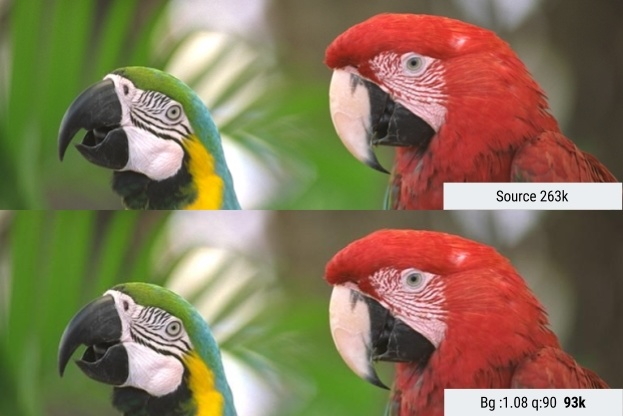

# 必要的图像优化


**我们应该对图像进行自动化压缩。**

应该自动优化图像。当最佳方案改变时，这点很容易被以往，尤其是在未进行**流水线式构建**时这一步很容易丢失。进行自动化：在你的构建过程中使用[imagemin](https://github.com/imagemin/imagemin) 或 [libvips](https://github.com/jcupitt/libvips) 工具，也存在着更多的替代方案。

大多数CDN(例如：[Akamai](https://www.akamai.com/us/en/solutions/why-akamai/image-management.jsp)) 和第三方解决方案，例如 [Cloudinary](https://cloudinary.com), [imgix](https://imgix.com), [Fastly’s Image Optimizer](https://www.fastly.com/io/), [Instart Logic’s SmartVision](https://www.instartlogic.com/technology/machine-learning/smartvision)或[ImageOptim API](https://imageoptim.com/api) 都提供有全面的图像自动优化方法。

你在阅读博客并调整配置文件上花的时间要大于使用第三方包月服务（Cloudinary有免费套餐）。如果你因为成本或延迟问题而不想将这项工作外包出去，那么上面提到的这些开源方案也是可靠的。像 [Imageflow](https://github.com/imazen/imageflow) 或 [Thumbor](https://github.com/thumbor/thumbor) 提供可选的自动托管方案。

**每个人应该对他们的图像进行有效的压缩。**

至少要使用 [ImageOptim](https://imageoptim.com/)。它可以在保持显示效果的同时能显著的降低文件大小。 在Windows和Linux平台也有各自可用的 [版本](https://imageoptim.com/versions.html) 。

更具体点来说，通过 [MozJPEG](https://github.com/mozilla/mozjpeg)（q = 80或更低，适用于Web内容）运行您的JPEG格式图像并考虑支持使用渐进式JPEG编码方式。PNG格式使用 [pngquant](https://pngquant.org/) ，SVG格式使用 [SVGO](https://github.com/svg/svgo)。要显式的删除图像的元数据（使用pngquant时可使用`--strip` ）来避免图像大小发生膨胀。使用[H.264](https://en.wikipedia.org/wiki/H.264/MPEG-4_AVC) 编码压缩方式的视频文件（或Chrome、Firefox和Opera支持的[WebM](https://www.webmproject.org/)）来替代体积过大的GIF动图，如果不行也至少使用 [Giflossy](https://github.com/kornelski/giflossy)进行处理。如果你有额外的CPU资源，并且需要高于网络平均质量的图像，还能接受较慢的编码速度，可以尝试使用[Guetzli](https://research.googleblog.com/2017/03/announcing-guetzli-new-open-source-jpeg.html)。

一些浏览器通过HTTP的Accept请求标头来声明所支持的图像格式。这可以用来有条件的提供一些格式，例如：基于Blink的浏览器（如Chrome）的有损的 [WebP](https://developers.google.com/speed/webp/)格式或其他浏览器可备用的JPEG / PNG等格式。

你可以做的有更多。有用于生成和提供`srcset`断点的工具。也可以在基于Blink的浏览器中使用 [client-hints](https://developers.google.com/web/updates/2015/09/automating-resource-selection-with-client-hints)（客户端提示）的方式自动选择资源，并且可以通过指定[Save-Data](https://developers.google.com/web/updates/2016/02/save-data)（数据持久化）标头提示浏览器选择“data savings（数据缓存）”，这样就可以向的用户发送更少字节的内容。

（译者注：关于Save-Data的介绍可参考这篇文章[Help Your Users 'Save-Data'](https://css-tricks.com/help-users-save-data/)）

你生成的图像文件大小越小，对用户提供的网络使用体验就越好，尤其是使用移动设备的用户。在这篇文章中，我们将探讨通过现代压缩技术减少图像尺寸的方法，同时将对图像质量的影响降至最低。


<details>
<summary><h2>目录</h2></summary>
<p>
<ul>
        <li><a href="#introduction">Introduction</a></li>
        <li><a href="#do-my-images-need-optimization">How can I tell if my images need to be optimized?</a></li>
        <li><a href="#choosing-an-image-format">How do I choose an image format?</a></li>
        <li><a href="#the-humble-jpeg">The humble JPEG</a></li>
        <li><a href="#jpeg-compression-modes">JPEG compression modes</a>
                <ul>
                        <li><a href="#the-advantages-of-progressive-jpegs">The advantages of Progressive JPEGs</a></li>
                        <li><a href="#whos-using-progressive-jpegs-in-production">Who’s using Progressive JPEGs in production?</a></li>
                        <li><a href="#the-disadvantages-of-progressive-jpegs">The disadvantages of Progressive JPEGs</a></li>
                        <li><a href="#how-to-create-progressive-jpegs">How do you create Progressive JPEGs?</a></li>
                        <li><a href="#chroma-subsampling">Chroma (or Color) Subsampling</a></li>
                        <li><a href="#how-far-have-we-come-from-the-jpeg">How far have we come from the JPEG?</a></li>
                        <li><a href="#optimizing-jpeg-encoders">Optimizing JPEG Encoders</a></li>
                        <li><a href="#what-is-mozjpeg">What is MozJPEG?</a></li>
                        <li><a href="#what-is-guetzli">What is Guetzli?</a></li>
                        <li><a href="#mozjpeg-vs-guetzli">How does MozJPEG compare to Guetzli?</a></li>
                        <li><a href="#butteraugli">Butteraugli</a></li>
                </ul>
        </li>
        <li><a href="#what-is-webp">What is WebP?</a>
                <ul>
                        <li><a href="#how-does-webp-perform">How does WebP perform?</a></li>
                        <li><a href="#whos-using-webp-in-production">Who’s using WebP in production?</a></li>
                        <li><a href="#how-does-webp-encoding-work">How does WebP encoding work?</a></li>
                        <li><a href="#webp-browser-support">WebP browser support</a></li>
                        <li><a href="#how-do-i-convert-to-webp">How do I convert my images to WebP?</a></li>
                        <li><a href="#how-do-i-view-webp-on-my-os">How do I view WebP images on my OS?</a></li>
                        <li><a href="#how-do-i-serve-webp">How do I serve WebP?</a></li>
                </ul>
        </li>
        <li><a href="#svg-optimization">SVG optimization</a></li>
        <li><a href="#avoid-recompressing-images-lossy-codecs">Avoid recompressing images with lossy codecs</a></li>
        <li><a href="#reduce-unnecessary-image-decode-costs">Reduce unnecessary image decode and resize costs</a>
                <ul>
                        <li><a href="#delivering-hidpi-with-srcset">Delivering HiDPI images using <code>srcset</code></a></li>
                        <li><a href="#art-direction">Art direction</a></li>
                </ul>
        </li>
        <li><a href="#color-management">Color management</a></li>
        <li><a href="#image-sprites">Image spriting</a></li>
        <li><a href="#lazy-load-non-critical-images">Lazy-load non-critical images</a></li>
        <li><a href="#display-none-trap">Avoiding the <code>display: none;</code> trap</a></li>
        <li><a href="#image-processing-cdns">Does an image processing CDN make sense for you?</a></li>
        <li><a href="#caching-image-assets">Caching image assets</a></li>
        <li><a href="#preload-critical-image-assets">Preloading critical image assets</a></li>
        <li><a href="#performance-budgets">Performance Budgets For Images</a></li>
        <li><a href="#closing-recommendations">Closing recommendations</a></li>
        <li><a href="#trivia">Trivia</a></li>
</ul>
</p>
</details>

## <a id="introduction" href="#introduction">简介</a>

**图像仍然是现如今网络空间膨胀额主要原因**

图像占用着大量的互联网带宽，因为通常来说图像的文件大小都比较大。根据[HTTP Archive](http://httparchive.org/)的数据，互联网传输过程中60%的数据都是由JPEG、PNG和GIF等图像组成。截止到2017年，平均大小为3.00MB的网站内容中，图像文件约占到 [1.7MB](http://httparchive.org/interesting.php#bytesperpage)。

据[Tammy Everts](https://www.linkedin.com/in/tammyeverts)所言，向页面添加图像或使现有图像变大已被证明可以提高[转换率](https://calendar.perfplanet.com/2014/images-are-king-an-image-optimization-checklist-for-everyone-in-your-organization/)（译者注：此处的转换率指的是网站的访问者转换为活跃用户）。图像不太可能消失，因此在有效的最小化图像压缩策略上的投资就变得非常重要。

<figure>
<picture>
<source
        data-srcset="images/book-images/Modern-Image00-small.jpg"
        media="(max-width: 640px)" />
<source
        data-srcset="images/book-images/Modern-Image00-medium.jpg"
        media="(max-width: 1024px)" />

<source
        data-srcset="images/book-images/Modern-Image00-large.jpg" />


<noscript>
  
</noscript>
</picture>
<figcaption>Per from 2016, images were the 2nd highest predictor of conversions with the best pages having 38% fewer images.根据2016年 [Soasta/Google 的研究](https://www.thinkwithgoogle.com/marketing-resources/experience-design/mobile-page-speed-load-time/)，图像是转换率的第二高预测因素，最佳页面的图像减少了38％。</figcaption>
</figure>

图像优化包含多种方式来减小图像大小，最终取决于你想要达到什么程度的视觉效果。

<figure>
<picture>
<source
        data-srcset="images/book-images/image-optimisation-small.jpeg"
        media="(max-width: 640px)" />
<source
        data-srcset="images/book-images/image-optimisation-medium.jpeg"
        media="(max-width: 1024px)" />

<source
        data-srcset="images/book-images/image-optimisation-large.jpeg" />


<noscript>
  
</noscript>
</picture>
<figcaption><strong>图像优化：</strong> 选择正确的格式，合理的压缩，相较于可以懒加载的图像优先加载关键图像。</figcaption>
</figure>

常见的图像优化包括：压缩、使用 [`<picture>`](https://developer.mozilla.org/en-US/docs/Web/HTML/Element/picture)或[``](https://developer.mozilla.org/en-US/docs/Learn/HTML/Multimedia_and_embedding/Responsive_images)来根据屏幕大小响应地降低尺寸，并且降低图像大小能降低解码成本。

<figure>
<picture>
<source
        data-srcset="images/book-images/chart_naedwl-small.jpg"
        media="(max-width: 640px)" />
<source
        data-srcset="images/book-images/chart_naedwl-medium.jpg"
        media="(max-width: 1024px)" />

<source
        data-srcset="images/book-images/chart_naedwl-large.jpg" />


<noscript>
  
</noscript>
</picture>
<figcaption>根据[HTTP Archive](http://jsfiddle.net/rviscomi/rzneberp/embedded/result/)表示，95%图像预加载就只有30KB！（可查看累积分布函数）</strong></figcaption>

</figure>

对我们来说，有足够的空间来对图像进行批量优化。

<figure>
<picture>
<source
        data-srcset="images/book-images/image-optim-small.jpg"
        media="(max-width: 640px)" />
<source
        data-srcset="images/book-images/image-optim-medium.jpg"
        media="(max-width: 1024px)" />

<source
        data-srcset="images/book-images/image-optim-large.jpg" />


<noscript>
  
</noscript>
</picture>

<figcaption>ImageOptim是免费的，通过现代压缩技术和剔除不必要的EXIF元数据来减少图像大小。</figcaption>

</figure>

如果你是一个设计师，你也可以使用ImageOptim为Sketch制作的[插件](https://github.com/ImageOptim/Sketch-plugin)，能在导出的时候能对你的资产进行优化。我发现它能节省好多时间。


## <a id="do-my-images-need-optimization" href="#do-my-images-need-optimization">如何判断图像是否需要优化？</a>

通过[WebPageTest.org](https://www.webpagetest.org/)站点进行审计，它会高亮显示可优化图像的机会。（详见“图像压缩”部分）

<figure>
<picture>
<source
        data-srcset="images/book-images/Modern-Image1-small.jpg"
        media="(max-width: 640px)" />
<source
        data-srcset="images/book-images/Modern-Image1-medium.jpg"
        media="(max-width: 1024px)" />

<source
        data-srcset="images/book-images/Modern-Image1-large.jpg" />


<noscript>
  
</noscript>
</picture>

<figcaption>WebPageTest报告的“压缩图像”部分列出了可以更有效地压缩的图像的方法以及预估可节省的文件大小。
</figcaption>
</figure>


<figure>
<picture>
<source
        data-srcset="images/book-images/Modern-Image2-small.jpg"
        media="(max-width: 640px)" />
<source
        data-srcset="images/book-images/Modern-Image2-large.jpg"
        media="(max-width: 1024px)" />

<source
        data-srcset="images/book-images/Modern-Image2-medium.jpg" />


<noscript>
  
</noscript>
</picture>
</figure>

[Lighthouse](https://developers.google.com/web/tools/lighthouse/) 为最佳性能表现提供审计。它包含审核图像优化方式，并可以为进一步压缩图像方式提供建议，或指出屏幕未显示的图像可以使用延迟加载方式进行加载。

从Chrome 60开始，Lighthouse在开发者工具的 [Audits面板](https://developers.google.com/web/updates/2017/05/devtools-release-notes#lighthouse) 中提供使用。

<figure>
<picture>
<source
        data-srcset="images/book-images/hbo-small.jpg"
        media="(max-width: 640px)" />
<source
        data-srcset="images/book-images/hbo-medium.jpg"
        media="(max-width: 1024px)" />

<source
        data-srcset="images/book-images/hbo-large.jpg" />


<noscript>
  
</noscript>
</picture>
<figcaption>Lighthouse可以审核Web的性能、最佳实践和渐进式Web应用程序功能。（注：Performance、Best Practices、Progressive Web App为audits的复选项。Best Practices表示Web是否按照最佳方法进行现代Web开发）</figcaption>
</figure>

您也可能还熟悉其他性能审核工具，如 [PageSpeed Insights](https://developers.google.com/speed/pagespeed/insights/) 或 [Website Speed Test](https://webspeedtest.cloudinary.com/)，其中包括详细的图像分析审核。


## <a id="choosing-an-image-format" href="#choosing-an-image-format">如何选择图像格式?</a>

正如Ilya Grigorik在他的杰作 [图像优化指南](https://developers.google.com/web/fundamentals/performance/optimizing-content-efficiency/image-optimization)中所指出的，“合适的”图像格式是视觉效果和功能要求的均衡（注：combination相比组合翻译成均衡更通顺些）。 你在使用位图还是矢量图形呢？

<figure>
<picture>
<source
        data-srcset="images/book-images/rastervvector-medium.png"
        media="(max-width: 640px)" />
<source
        data-srcset="images/book-images/rastervvector-large.png"
        media="(max-width: 1024px)" />

<source
        data-srcset="images/book-images/rastervvector-small.png" />


<noscript>
  
</noscript>
</picture>
</figure>

[位图](https://en.wikipedia.org/wiki/Raster_graphics)通过对像素矩阵内的每一个像素的值进行编码来表示图像，与分辨率或缩放无关。WebP或者应用广泛的格式（例如PNG，JPEG）都可以很好的在保持图像内容的情况下处理这些图像。我们讨论过的Guetzli，MozJPEG或其他格式也同样适用于位图。

[矢量图形](https://en.wikipedia.org/wiki/Vector_graphics) 使用点、线和多边形来表示图像和格式，使用简单的几何形状（例如logo）提供高分辨率和缩放，像SVG在处理这种情况会更好。（TODO）

[矢量图形](https://en.wikipedia.org/wiki/Vector_graphics) use points, lines and polygons to represent images and formats using simple geometric shapes (e.g. logos) offering a high-resolution and zoom like SVG handle this use case better.

错误的格式会让你付出代价，选择使用正确格式的逻辑流程可能充满风险，因此使用其他格式保存图像进行实验可以规避这些风险。（TODO）

Jeremy Wagner 在他的图像优化演讲中谈到了评估使用格式时值得考虑的权重（[示例](http://jlwagner.net/talks/these-images/#/2/2) ）。

## <a id="the-humble-jpeg" href="#the-humble-jpeg">精简的JPEG</a>

JPEG应该是世界上使用最广泛的图像格式。 如前文所述，HTTP Archive在抓取网站上的图像的 [统计结果](http://httparchive.org/interesting.php) 可以看到其中有45％是JPEG。你的手机，数码单反相机，老式网络摄像头等这些设备都支持这种编解码方式。 这种格式也很久远，可以追溯到1992年时首次发布。 在那段时间里，它被已经被进行了大量的研究来尝试改进它的编码方式。

JPEG是一种有损压缩算法，它丢弃部分信息来节省存储空间，并且在尝试保持视觉效果的基础上尽可能使文件大小尽可能的小。

**您的项目可接受什么程度图像质量？**

JPEG等格式最适合具有多个颜色区域的照片或图像。 大多数优化工具允许你设置期望的压缩级别; 较高的压缩级别会减小文件大小，但会产生引入伪像，光晕等额外噪声。（译者注：[artifacts](https://en.wikipedia.org/wiki/Compression_artifact#Artistic_use) 指的是过度锐化或细节丢失等影响视觉显示效果的瑕疵，由于JPEG的DTC压缩导致出现方块现象，可以参考论坛的[讨论](http://forum.xitek.com/forum.php?mod=viewthread&tid=1605692&page=1&ordertype=1) 。后续该词翻译为伪像)。

<figure>
<picture>
<source
        data-srcset="images/book-images/Modern-Image5-small.jpg"
        media="(max-width: 640px)" />
<source
        data-srcset="images/book-images/Modern-Image5-medium.jpg"
        media="(max-width: 1024px)" />

<source
        data-srcset="images/book-images/Modern-Image5-large.jpg" />


<noscript>
  
</noscript>
</picture>
<figcaption>JPEG：可感知的JPEG压缩伪影会随着我们从最佳质量到最低质量的转变而显著增加。请注意，一个工具中的图像质量分数可能与另一个工具中的质量分数有所不同。</figcaption>

</figure>

当选择需要设置图像的质量时，请考虑您的图像属于哪个范畴：

- **最佳质量**–当质量比带宽更重要。这可能是因为图像在您的设计中具有很高的突出度或以全分辨率显示。
- **良好的质量**-当您更关心传输较小的文件，但不想对图像质量造成太大的影响。用户相对更关心图像质量。
- **低质量**-当你更关心带宽，适量的图像降级是可以接受的。这些图像适用于不稳定或较差的网络条件。
- **最低质量**-节省带宽更为重要。为了更快的加载页面，用户能接受相对较差的用户体验。

接下来，让我们将讨论一下JPEG的压缩模式，因为这些模式对体验性能变化有很大的影响。

<aside class="note"><b>Note:</b> 有时我们可能高估了用户对图像质量的需求。图像质量可以被视为与未压缩前理想的图像的偏差，这种偏差具有主观性。（100%图像质量可被理解为无偏差）</aside>
## <a id="jpeg-compression-modes" href="#jpeg-compression-modes">JPEG 压缩模式</a>

JPEG图像格式具有许多不同的[压缩模式](http://cs.haifa.ac.il/~nimrod/Compression/JPEG/J5mods2007.pdf)。 三种流行的模式是基线方式（顺序），渐进式（PJPEG）和无损方式。

**基线（或顺序）JPEG和渐进式JPEG有何不同？**

基线JPEG（大多数图像编辑和优化工具的默认值）以相对简单的方式进行编码和解码：从上到下。在缓慢或不稳定的连接上以基线方式加载JPEG时，用户会先看到图像的顶部，随着图像的加载会逐行显示更多的内容。无损JPEG类似，但压缩比较小。


<figure>
<picture>
<source
        data-srcset="images/book-images/Modern-Image6-small.jpg"
        media="(max-width: 640px)" />
<source
        data-srcset="images/book-images/Modern-Image6-medium.jpg"
        media="(max-width: 1024px)" />

<source
        data-srcset="images/book-images/Modern-Image6-large.jpg" />


<noscript>
  
</noscript>
</picture>
<figcaption>基线JPEG从上到下加载，而渐进式JPEG从模糊加载到清晰。</figcaption>
</figure>

渐进式jpeg将图像分成若干个扫描阶段。第一次扫描显示位于模糊或低质量的图像区域，随后的扫描再提高图像质量。把这看作是“逐步”加载。图像的每次“扫描”都会增加细节级别。合并后，将创建显示完整质量的图像。

<figure>
<picture>
<source
        data-srcset="images/book-images/Modern-Image7-small.jpg"
        media="(max-width: 640px)" />
<source
        data-srcset="images/book-images/Modern-Image7-medium.jpg"
        media="(max-width: 1024px)" />

<source
        data-srcset="images/book-images/Modern-Image7-large.jpg" />


<noscript>
  
</noscript>
</picture>
<figcaption>基线JPEG从上到下加载图像。渐进式JPEG从低分辨率（模糊）加载到高分辨率。 Pat Meenan编写了一个[交互式工具](http://www.patrickmeenan.com/progressive/view.php?img=https%3A%2F%2Fwww.nps.gov%2Fplanyourvisit%2Fimages%2FGrandCanyonSunset_960w.jpg) 来测试和了解渐进式JPEG加载方式。</figcaption>
</figure>

通过删除数码相机或编辑器添加的[EXIF数据](http://www.verexif.com/en/)，优化图像的[Huffman表](https://en.wikipedia.org/wiki/Huffman_coding)或重新扫描图像，可以实现无损的JPEG优化。 像[jpegtran](http://jpegclub.org/jpegtran/) 这样的工具通过重新排列压缩数据而不会降低图像质量来实现图像的无损压缩。 [jpegrescan](https://github.com/kud/jpegrescan), [jpegoptim](https://github.com/tjko/jpegoptim) 和 [mozjpeg](https://github.com/mozilla/mozjpeg)（我们将在稍后介绍）也支持无损JPEG压缩。

### <a id="the-advantages-of-progressive-jpegs" href="#the-advantages-of-progressive-jpegs">渐进式JPEG的优点</a>

渐进式JPEG在加载时提供图像的低分辨率“预览”的方式，与自适应图像相比提高了用户的体验，用户可以感觉图像加载速度更快。

在较慢的3G连接上，这种方式允许用户在仅接收到部分文件时（粗略地）查看图像中的内容，并决定是否等待其完全加载。 这比基线JPEG提供的图像从上到下显示方式更令人愉快。

<figure>
<picture>
<source
        data-srcset="images/book-images/pjpeg-graph-small.png"
        media="(max-width: 640px)" />
<source
        data-srcset="images/book-images/pjpeg-graph-medium.png"
        media="(max-width: 1024px)" />

<source
        data-srcset="images/book-images/pjpeg-graph-large.png" />


<noscript>
  
</noscript>
</picture>
<figcaption>2015年，Facebook转向了使用渐进式JPEG（[用于iOS应用程序](https://code.facebook.com/posts/857662304298232/faster-photos-in-facebook-for-ios/)），数据使用量减少了10%。他们能够以比以前快15%的速度显示高质量的图像，优化图像的加载时间，如上图所示。</figcaption>
</figure>

对于超过10KB的图像，渐进式JPEG可以改善压缩能力，与基线/简单JPEG相比，带宽减少 [2-10%](http://www.bookofspeed.com/chapter5.html) 。 它们的压缩比更高，这要归功于JPEG中的每次扫描都能够使用自己专用的可选[Huffman 表](https://en.wikipedia.org/wiki/Huffman_coding)。 现代JPEG编码器（例如：[libjpeg-turbo](http://libjpeg-turbo.virtualgl.org/)，MozJPEG等）利用PJPEG的灵活性来更好地打包数据。

<aside class="note"><b>Note:</b> 为什么渐进式JPEG压缩得更好？ 基线JPEG的数据库块一次编码一个。 利用渐进式JPEG，可以将多个数据块的类似[离散余弦变换](https://en.wikipedia.org/wiki/Discrete_cosine_transform) 系数编码在一起，从而实现更好的压缩。</aside>
渐进式JPEG的另一个优点是在HTTP2上，页面和第一个扫描层同时加载，这[提高了用户查看初始图像内容的速度](https://calendar.perfplanet.com/2016/even-faster-images-using-http2-and-progressive-jpegs/)，并使浏览器能够更快地布局页面元素。 将其与渐进式JPEG的定制扫描层相结合，例如：通过[向mozjpeg提供自定义扫描文件](https://calendar.perfplanet.com/wp-content/uploads/2016/12/scans.txt)或使用[Cloudinary的自定义PJPEG选项](http://cloudinary.com/blog/progressive_jpegs_and_green_martians)，可以更快地为用户呈现真正有意义的图像内容。

### <a id="whos-using-progressive-jpegs-in-production" href="#whos-using-progressive-jpegs-in-production">谁在产品中使用渐进式JPEG？</a>

-  [Twitter.com使用渐进式JPEG](https://www.webpagetest.org/performance_optimization.php?test=170717_NQ_1K9P&run=2#compress_images) ，其基线质量为85％。 他们测量了用户感知延迟（第一次扫描的时间和总加载时间），发现就总体而言渐进式JPEG可以很好的满足其对低文件大小，可接受的转码/解码时间等要求的方面。
 -  [Facebook为其iOS应用程序提供渐进式JPEG](https://code.facebook.com/posts/857662304298232/faster-photos-in-facebook-for-ios/)。 他们发现数据使用量减少10％，并且显示高质量图像的加载速度提高15％。
 -  [Yelp选择使用渐进式JPEG](https://engineeringblog.yelp.com/2017/06/making-photos-smaller.html) ，发现可以减少约4.5％的图像大小。 他们还使用MozJPEG节省了13.8％的额外费用。

许多图像占比很高的网站，例如 [Pinterest](https://pinterest.com) ，也在产品中使用了渐进式JPEG。

<figure>
<picture>
<source
        data-srcset="images/book-images/pinterest-loading-small.png"
        media="(max-width: 640px)" />
<source
        data-srcset="images/book-images/pinterest-loading-medium.png"
        media="(max-width: 1024px)" />

<source
        data-srcset="images/book-images/pinterest-loading-large.png" />


<noscript>
  
</noscript>
</picture>
<figcaption>Pinterest’s JPEGs are all progressively encoded. This optimizes the user experience by loading them each scan-by-scan.</figcaption>
</figure>

### <a id="the-disadvantages-of-progressive-jpegs" href="#the-disadvantages-of-progressive-jpegs">渐进式JPEG的缺点</a>

渐进式JPEG的解码速度可能比基线JPEG慢——甚至长达3倍。 在具有强大CPU的桌面计算机上，这也许不是一个问题，而是在性能资源有限的的移动设备上。 您基本上需要多次解码过程来显示不完整的图层，这些多次传输可能会占用CPU周期。

渐进式JPEG也不总是体积更小。 对于非常小的图像（如缩略图），渐进式JPEG可能比基线JPEG对应的图片体积要大。 然而，对于这样的小缩略图，渐进式渲染方式带来的价值不会很高。

这意味着在决定是否传输渐进式JPEG时，您需要尝试取得文件大小、网络延迟和CPU周期使用之间的正确平衡。


注意：渐进式JPEG（和所有JPEG）有时可以在移动设备上进行硬解码。 它无法改善对内存占用的影响，但它可以消除一些CPU占用问题。但 并非所有Android设备都支持硬件加速，但高端设备以及所有iOS设备是支持的。
一些用户可能认为渐进式的加载方式是一个缺陷，因为很难判断图像是否已经加载完成。 由于每不同用户之间可能会有很大差异，因此需要您对您的用户的体验进行评估。

### <a id="how-to-create-progressive-jpegs" href="#how-to-create-progressive-jpegs">如何创建渐进式JPEG？</a>

例如 [ImageMagick](https://www.imagemagick.org/), [libjpeg](http://libjpeg.sourceforge.net/), [jpegtran](http://jpegclub.org/jpegtran/), [jpeg-recompress](https://github.com/danielgtaylor/jpeg-archive) 和 [imagemin](https://github.com/imagemin/imagemin) 等工具和类库支持导出渐进式JPEG。 如果您有一个现成的图像优化管道，那么可以直接添加渐进式图像加载支持：

```js
const gulp = require('gulp');
const imagemin = require('gulp-imagemin');

gulp.task('images', function () {
    return gulp.src('images/*.jpg')
        .pipe(imagemin({
            progressive: true
        }))
        .pipe(gulp.dest('dist'));       
});
```

大多数图像编辑工具默认将图像保存为基线JPEG文件。

<figure>
<picture>
<source
        data-srcset="images/book-images/photoshop-small.jpg"
        media="(max-width: 640px)" />
<source
        data-srcset="images/book-images/photoshop-medium.jpg"
        media="(max-width: 1024px)" />

<source
        data-srcset="images/book-images/photoshop-large.jpg" />


<noscript>
  
</noscript>
</picture>
<figcaption>大多数图像编辑工具默认将图像保存为基线JPEG文件。 您可以通过转到文件 - >导出 - >保存为Web（旧版），然后单击渐进式选项，将您在Photoshop中创建的任何图像保存为渐进式JPEG。 Sketch还支持直接导出渐进式JPEG  - 导出为JPG并在保存图像时选中“渐进式”复选框。</figcaption>
</figure>

### <a id="chroma-subsampling" href="#chroma-subsampling">色度（或色彩）子采样</a>

（注：Subsampling也可翻译为亚采样，[下采样](<https://www.cnblogs.com/jokerjason/p/9429452.html>)）

我们的眼睛对于图像（色度）中的颜色细节比对亮度（或简称亮度 - 亮度的度量）更容易丢失。 [色度子采样](https://en.wikipedia.org/wiki/Chroma_subsampling) 是一种压缩方式，可降低图像信号中的颜色精度，提高亮度。 这样可以减小文件大小而不会对图像质量产生负面影响，在某些情况下可以降低达 [15-17%](https://calendar.perfplanet.com/2015/why-arent-your-images-using-chroma-subsampling/)，并且是可以用于JPEG图像。 亚采样还可以减少图像内存使用量。

<figure>
<picture>
<source
        data-srcset="images/book-images/luma-signal-small.jpg"
        media="(max-width: 640px)" />
<source
        data-srcset="images/book-images/luma-signal-medium.jpg"
        media="(max-width: 1024px)" />

<source
        data-srcset="images/book-images/luma-signal-large.jpg" />


<noscript>
  
</noscript>
</picture>
</figure>

由于对比度负责形成我们在图像中看到的形状，因此定义它的亮度非常重要。 老式的旧照片或黑白照片不包含颜色，但由于亮度的原因，它们的显示效果可以像它们的颜色一样细腻。 色度（颜色）对视觉感知的影响较小。

<figure>
<picture>
<source
        data-srcset="images/book-images/no-subsampling-small.jpg"
        media="(max-width: 640px)" />
<source
        data-srcset="images/book-images/no-subsampling-medium.jpg"
        media="(max-width: 1024px)" />

<source
        data-srcset="images/book-images/no-subsampling-large.jpg" />


<noscript>
  
</noscript>
</picture>
<figcaption>JPEG支持许多不同的子采样类型：无，水平和水平以及垂直。 该图来自FrédéricKayser的[马蹄蟹的JPEG](http://frdx.free.fr/JPEG_for_the_horseshoe_crabs.pdf) 。</figcaption>
</figure>

在谈论子采样时，讨论了许多常见的样本。 通常为`4:4:4`，`4:2:2`和`4:2:0`。 但这些代表什么呢？ 假设子样本采用格式A:B:C。 A是一行中的像素数，对于JPEG，这通常是4. B表示第一行中的颜色量，C表示第二行中的颜色。

There are a number of common samples discussed when talking about subsampling. Generally, `4:4:4`, `4:2:2` and `4:2:0`. But what do these represent? Let’s say a subsample takes the format A:B:C. A is the number of pixels in a row and for JPEGs this is usually 4. B represents the amount of color in the first row and C the color in the second.

 -  `4:4:4` 没有压缩，因此颜色和亮度完全被传输。
 -  `4:2:2` 水平半采样，垂直全采样。
 -  `4:2:0` 从第一行像素的一半中采样颜色，忽略第二行。

<aside class="note"><b>Note:</b> jpegtran和cjpeg支持单独的亮度和色度质量配置。 这可以通过添加`-sample`标志来完成（例如`-sample 2x1`）。

一些好的一般规则：子采样（`-sample 2x2`）非常适合照片。 无子采样（`-sample 1x1`）最适用于屏幕截图、横幅和按钮。 最后（`2x1`）在你不确定要使用什么的时候使用。</aside>

通过减少色度分量中的像素，可以显着减小颜色分量的大小，最终减小字节大小。

（TODO）

<figure>
<picture>
<source
        data-srcset="images/book-images/subsampling-small.jpg"
        media="(max-width: 640px)" />
<source
        data-srcset="images/book-images/subsampling-medium.jpg"
        media="(max-width: 1024px)" />

<source
        data-srcset="images/book-images/subsampling-large.jpg" />


<noscript>
  
</noscript>
</picture>
<figcaption>质量为80的JPEG的色度子采样配置。</figcaption>
</figure>

对于大多数类型的图像，使用色度子采样是值得考虑的。 它也有一些值得注意的例外：由于子采样依赖于我们人眼视觉的限制，因此对于其中颜色细节可能与亮度一样重要（例如医学图像）的压缩图像使用起来并不是很好。

包含字体的图像也会受到影响，因为文本的不良二次取样会降低其易读性。 更锐利的边缘难以使用JPEG压缩，因为它旨在更好地处理具有更柔和过渡的摄影场景。

<figure>
<picture>
<source
        data-srcset="images/book-images/Screen_Shot_2017-08-25_at_11.06.27_AM-small.jpg"
        media="(max-width: 640px)" />
<source
        data-srcset="images/book-images/Screen_Shot_2017-08-25_at_11.06.27_AM-medium.jpg"
        media="(max-width: 1024px)" />

<source
        data-srcset="images/book-images/Screen_Shot_2017-08-25_at_11.06.27_AM-large.jpg" />


<noscript>
  
</noscript>
</picture>
<figcaption>[Understanding JPEG](http://compress-or-die.com/Understanding-JPG/) 一文中建议在处理包含文本的图像时，使用4:4:4(1×1) 的子采样</figcaption>
</figure>

备注：JPEG规范中未指定色度子采样的确切方法，因此不同的解码器处理它的方式不同。 MozJPEG和libjpeg-turbo使用相同的缩放方法。 较旧版本的libjpeg使用不同的方法来添加颜色中的铃声伪像。（TODO）

Trivia: The exact method of Chroma subsampling wasn’t specified in the JPEG specification, so different decoders handle it differently. MozJPEG and libjpeg-turbo use the same scaling method. Older versions of libjpeg use a different method that adds ringing artifacts in colors.

<aside class="note"><b>Note:</b> 使用“保存为网络图像”的功能时，Photoshop会自动设置色度子采样。 当图像质量设置在51-100之间时，不会使用子采样（`4:4:4`）。 当质量低于此值时，将使用`4:2:0`子采样。 这是当质量从51切换到50时可以显著观察到的文件大小降低的一个原因。</aside>
<aside class="note"><b>Note:</b>在二次抽样讨论中，经常提到术语 [YCbCr](https://en.wikipedia.org/wiki/YCbCr)。 这是一个可以表示伽马校正的 [RGB](https://en.wikipedia.org/wiki/RGB_color_model) 色彩空间的模型。 Y是伽马校正的亮度，Cb是蓝色的色度分量，Cr是红色的色度分量。 当你观察ExifData时，你会看到YCbCr接近采样水平。</aside>
有关色度子采样的进一步阅读，请参考[为什么您的图像不使用色度子采样？](https://calendar.perfplanet.com/2015/why-arent-your-images-using-chroma-subsampling/)

（TODO，该章节涉及了好多图像显示方面的专业数据，翻译粗略的参考谷歌翻译以及部分博客，还需要对术语等进行校对调整）

### <a id="how-far-have-we-come-from-the-jpeg" href="#how-far-have-we-come-from-the-jpeg">我们举例JPEG有多遥远？</a>

**以下是当前网络上图像格式的分布状态：**

*tl;dr – 这非常的分散，我们通常使用不同的现代图像处理技术有选择的对不同的浏览器提供不同的格式支持*


<figure>
<picture>
<source
        data-srcset="images/book-images/format-comparison-small.jpg"
        media="(max-width: 640px)" />
<source
        data-srcset="images/book-images/format-comparison-medium.jpg"
        media="(max-width: 1024px)" />

<source
        data-srcset="images/book-images/format-comparison-large.jpg" />


<noscript>
  
</noscript>
</picture>
<figcaption>不同的现代图像格式（和优化器）用于演示目标文件大小在26KB的可能处理方式。 我们可以使用[SSIM](https://en.wikipedia.org/wiki/Structural_similarity) （结构相似性）或 [Butteraugli](https://github.com/google/butteraugli)来比较图像质量，我们将在后面详细介绍。</figcaption>
</figure>

（译者注：Butteraugli 是 Google 的一个开源工具，用来评判两个图像之间的相似度。通过识别图像之间一些最受关注的差异点并给出相似度分值。）

*   **[JPEG 2000](https://en.wikipedia.org/wiki/JPEG_2000) (2000)** – 从基于离散余弦的变换到基于小波的方法的JPEG切换的改进。 **浏览器支持：Safari桌面+ iOS**
*   **[JPEG XR](https://en.wikipedia.org/wiki/JPEG_XR) (2009)** – 支持 [HDR](http://wikivisually.com/wiki/High_dynamic_range_imaging) 和[宽色域](http://wikivisually.com/wiki/Gamut) 空间的JPEG和JPEG 2000的替代品。 以稍慢的编码/解码速度生成比JPEG更小的文件。 **浏览器支持：Edge，IE。**
*   **[WebP](https://en.wikipedia.org/wiki/WebP) (2010)** – 谷歌研发的基于块预测的格式，支持有损和无损压缩。 提供类似JPEG的字节存储和类似PNG的透明度支持。由于缺乏色度子采样配置和渐进加载， 解码时间也比JPEG解码慢。**浏览器支持：Chrome，Opera。 通过Safari和Firefox进行实验。**
*   **[FLIF](https://en.wikipedia.org/wiki/Free_Lossless_Image_Format) (2015)** – 声称优于PNG的无损图像格式、无损WebP、无损BPG和基于压缩比的无损JPEG 2000。 **浏览器支持：无。 请注意，有一个[JS浏览器内解码器](https://github.com/UprootLabs/poly-flif)。**
*   **HEIF and BPG.** 从压缩的角度来看，它们是相同的，但具有不同的包装器。
*   **[BPG](https://en.wikipedia.org/wiki/Better_Portable_Graphics) (2015)** – 基于HEVC（[高效视频编码](http://wikivisually.com/wiki/High_Efficiency_Video_Coding)），旨在提高JPEG的压缩效率。 与MozJPEG和WebP相比，似乎可以提供更好的文件大小。 由于许可证问题而不太可能获得广泛的应用。 **浏览器支持：无。 请注意，有一个[JS浏览器内解码器](https://bellard.org/bpg/)。**
*   **[HEIF](https://en.wikipedia.org/wiki/High_Efficiency_Image_File_Format) (2015)** – 用于存储具有约束的帧间可预测的HEVC编码图像的图像和图像序列的格式。 Apple在 [WWDC](https://www.cnet.com/news/apple-ios-boosts-heif-photos-over-jpeg-wwdc/) 上宣布他们将探索在iOS上切换从JPEG到HEIF的使用，理由是文件大小可节省2倍。 **浏览器支持：在撰写本文时没有。 最终，Safari桌面和iOS 11**（TODO）

如果您为了可视化，可能会欣赏上述提供的视觉比较工具。（ [tools one](https://people.xiph.org/~xiphmont/demo/daala/update1-tool2b.shtml) 、 [tools these](http://xooyoozoo.github.io/yolo-octo-bugfixes/#cologne-cathedral&jpg=s&webp=s)）

因此，**浏览器的支持是分散的**，如果您希望利用上述任何一项，您可能需要有条件地为每个目标浏览器提供支持。 在Google，我们已经看到了WebP的一些实现，所以我们很快就会深入探讨它。

您还可以根据浏览器可支持渲染的图像来决定使用.jpg扩展名（或任何其他）提供图像格式（例如WebP，JPEG 2000）的媒体类型支持。 这允许服务器端[内容类型协商](https://www.igvita.com/2012/12/18/deploying-new-image-formats-on-the-web/)决定发送哪个图像而不需要更改HTML。 Instart Logic等服务在向客户提供图像时使用此方法。

接下来，让我们谈谈当您无法有条件地提供不同图像格式时的可选方案：**优化JPEG编码器**。

### <a id="optimizing-jpeg-encoders" href="#optimizing-jpeg-encoders">优化JPEG编码器s</a>

现代JPEG编码器尝试生成更小，更高保真度的JPEG文件，同时保持与现有浏览器和图像处理应用程序的兼容性。 它们避免了在生态系统中引入新的图像格式或更改，来实现压缩增益。。 两个这样的编码器分别是是MozJPEG和Guetzli。

***tl;dr 您应该使用哪个jpeg优化编码器？***

* 一般的Web资产：MozJPEG
* 更关心质量甚于编码时长：使用Guetzli
* 如果您需要可配置性：
 * [JPEGRecompress](https://github.com/danielgtaylor/jpeg-archive) (在MozJPEG的技术长构建) 注：该项目编译时需要引入MozJPEG依赖。
 * [JPEGMini](http://www.jpegmini.com/)。它类似于Guetzli——自动选择最佳质量。虽然技术上不如Guetzli复杂，但速度更快，而且目标是质量范围更适合网络使用。
 * [ImageOptim API](https://imageoptim.com/api) (带有免费的在线界面](https://imageoptim.com/online)) 。它在颜色处理方面是独一无二的。您可以单独选择颜色质量和整体质量。它自动选择色度次采样级别，以保持屏幕截图中的高分辨率颜色，但与此同时还能避免在自然照片中的平滑颜色上浪费字节。


### <a id="what-is-mozjpeg" href="#what-is-mozjpeg">什么是MozJPEG？</a>

Mozilla以 [MozJPEG](https://github.com/mozilla/mozjpeg)的形式提供现代化的JPEG编码器。 它宣城可以减少高达10％的JPEG文件体积。 使用MozJPEG压缩的文件支持跨浏览器工作，它包括逐行扫描优化，网格量化（丢弃最少压缩的细节）和一些优化的量化表预设等常用功能，有助于创建更平滑的高DPI图像（尽管ImageMagick可以实现这一点如果你愿意研究XML配置）。

[ImageOptim](https://github.com/ImageOptim/ImageOptim/issues/45) 支持MozJPEG，并且有一个相对可靠的可配置 [imagemin插件](https://github.com/imagemin/imagemin-mozjpeg) 。 以下是Gulp的示例实现：

```js
const gulp = require('gulp');
const imagemin = require('gulp-imagemin');
const imageminMozjpeg = require('imagemin-mozjpeg');

gulp.task('mozjpeg', () =>
    gulp.src('src/*.jpg')
    .pipe(imagemin([imageminMozjpeg({
        quality: 85
    })]))
    .pipe(gulp.dest('dist'))
);
```

<figure>
<picture>
<source
        data-srcset="images/book-images/Modern-Image10-small.jpg"
        media="(max-width: 640px)" />
<source
        data-srcset="images/book-images/Modern-Image10-medium.jpg"
        media="(max-width: 1024px)" />

<source
        data-srcset="images/book-images/Modern-Image10-large.jpg" />


<noscript>
  
</noscript>
</picture>
</figure>


<figure>
<picture>
<source
        data-srcset="images/book-images/Modern-Image11-small.jpg"
        media="(max-width: 640px)" />
<source
        data-srcset="images/book-images/Modern-Image11-medium.jpg"
        media="(max-width: 1024px)" />

<source
        data-srcset="images/book-images/Modern-Image11-large.jpg" />


<noscript>
  
</noscript>
</picture>
<figcaption>MozJPEG：不同质量的文件大小和视觉相似度得分的比较。</figcaption>
</figure>

我使用 [jpeg-archive](https://github.com/danielgtaylor/jpeg-archive) 项目中的 [jpeg-compress](https://github.com/imagemin/imagemin-jpeg-recompress) 来计算源图像的SSIM（结构相似度）分数。 SSIM是一种用于测量两个图像之间的相似性的方法，其中SSIM得分是相对于另一个给定的被认为是“完美的”图像的质量度量。


根据我的经验，MozJPEG是一个很好的选择，可以在高视觉效果的情况下压缩网络图像来减少文件大小。 对于中小尺寸的图像，我发现MozJPEG（质量= 80-85）可以节省30-40％的文件大小，同时保持可接受的SSIM，在jpeg-turbo上提供5-6％的提升。 它确实具有比基线JPEG具有[更高的编码成本](http://www.libjpeg-turbo.org/About/Mozjpeg)，但你可能不会发现显式的阻塞。（注：show stopper可理解为严重程度极高的硬件或[软件错误](https://en.wikipedia.org/wiki/Software_bug)，需要立即修复）

<aside class="note"><b>Note:</b>如果您需要一个支持MozJPEG的工具以及一些额外的配置支持和一些免费的图像比较工具，请查看 [jpeg-recompress](https://github.com/danielgtaylor/jpeg-archive)。 Web Performance in Action的作者Jeremy Wagner在使用[此配置](https://twitter.com/malchata/status/884836650563579904) 时取得了一些成功。</aside>
### <a id="what-is-guetzli" href="#what-is-guetzli">什么是Guetzli？</a>

[Guetzli](https://github.com/google/guetzli) 是一款很有发展情景的慢速可感知的JPEG编码器，谷歌尝试找到最小的JPEG，使得它在感知上与人眼无法区分。 它执行一系列测试，产生最终JPEG的方案，解释每个方案中心理视觉偏差。最终它选择得分最高的方案作为最终输出。

为了测量图像之间的差异，Guetzli使用[Butteraugli](https://github.com/google/butteraugli)，一种基于人类感知测量图像差异的模型（下面讨论）。 Guetzli可以考虑其他JPEG编码器没有的一些视觉属性。 例如，在所看到的绿光量和对蓝色的敏感度之间存在关系，因此可以稍微不那么精确地编码绿色附近的蓝色变化。

<aside class="note"><b>Note:</b>图像文件大小**更多地取决于质量**的选择而不是**编解码器**的选择。与通过切换编解码器实现的文件大小节省相比，最低和最高质量JPEG之间的文件大小差异要大得多。 使用最低的可接受质量非常重要。 如果非必要，请避免将质量设置得过高。 </aside>
与其他压缩方式相比，Guetzli[宣称](https://research.googleblog.com/2017/03/announcing-guetzli-new-open-source-jpeg.html ) 对于给定的Butteraugli分数，图像的数据大小减少了20-30％。 对于使用Guetzli的一个严重的警告是它非常非常慢，目前仅适用于静态内容。 从README，我们可以注意到Guetzli需要大量内存 - 每百万像素可能需要1分钟+ 200MB RAM。 在这个GitHub的一个[issue](https://github.com/google/guetzli/issues/50)中，有一个关于Guetzli实际体验的准确描述。 当您在静态站点的构建过程中对图像进行优化时，它是理想的选择，但在按需执行时则不太理想。

<aside class="note"><b>Note:</b>作为静态站点的构建过程中优化图像时，Guetzli可能更适合。或者不用按需执行图像优化的情况。 </aside>
像ImageOptim这样的工具支持Guetzli优化（在[最新版本](https://imageoptim.com/)中）。

```js
const gulp = require('gulp');
const imagemin = require('gulp-imagemin');
const imageminGuetzli = require('imagemin-guetzli');

gulp.task('guetzli', () =>
    gulp.src('src/*.jpg')
    .pipe(imagemin([
        imageminGuetzli({
            quality: 85
        })
    ]))
    .pipe(gulp.dest('dist'))

);
```

<figure>
<picture>
<source
        data-srcset="images/book-images/Modern-Image12-small.jpg"
        media="(max-width: 640px)" />
<source
        data-srcset="images/book-images/Modern-Image12-medium.jpg"
        media="(max-width: 1024px)" />

<source
        data-srcset="images/book-images/Modern-Image12-large.jpg" />


<noscript>
  
</noscript>
</picture>
</figure>

使用Guetzli编码3 x 3MP图像来节省存储空间需要差不多7分钟（以及高CPU使用率）。 为了存档更高分辨率的照片，我能看出它有很重要的价值。

<figure>
<picture>
<source
        data-srcset="images/book-images/Modern-Image13-small.jpg"
        media="(max-width: 640px)" />
<source
        data-srcset="images/book-images/Modern-Image13-medium.jpg"
        media="(max-width: 1024px)" />

<source
        data-srcset="images/book-images/Modern-Image13-large.jpg" />


<noscript>
  
</noscript>
</picture>
<figcaption>Guetzli：不同质量的文件大小和视觉相似度得分的比较。</figcaption>
</figure>

<aside class="note"><b>Note:</b>建议在高质量图像上运行Guetzli（例如，未压缩的输入图像，PNG源或100％质量或接近的JPEG）。虽然它也可以用于其他图像（例如质量为84或更低的JPEG），但结果可能更差。</aside>
虽然使用Guetzli压缩图像非常（非常）耗时并且会使您的风扇疯狂旋转，但对于较大的图像，这是值得的。 我已经看到了许多例子，在保持视觉逼真度的同时，它可以在任何地方保存高达40%的文件大小。 这使其非常适合存档照片。 在中小尺寸的图像上，我仍然看到了一些节省（在10-15KB范围内），但它们并没有那么明显。 Guetzli可以在压缩时在较小的图像上引入更多的液化扭曲。

您可能还对Eric Portis研究感兴趣，将Guetzli与Cloudinary的自动压缩进行[比较](https://cloudinary.com/blog/a_closer_look_at_guetzli) ，以获得有效的不同数据点。

### <a id="mozjpeg-vs-guetzli" href="#mozjpeg-vs-guetzli">MozJPEG与Guetzli相比如何？</a>

比较不同的JPEG编码器很复杂程度，需要比较压缩图像的质量和保真度以及最终尺寸。 正如图像压缩专家KornelLesiński指出的那样，对这些方面中的一个而非两个方面进行基准测试可能会导致[无效](https://kornel.ski/faircomparison)的结论。

Guetzli与MozJPEG相比如何？  -  Kornel的观点：

 -  Guetzli更关心获得更高质量的图像（据说`q=90+` 最适合，但是MozJPEG的最佳点是`q=75`左右）
 -  Guetzli的压缩速度要慢得多（两者都产生标准的JPEG，所以解码像往常一样快）
 -  MozJPEG不会自动选择质量设置，但您可以使用外部工具找到最佳质量，例如： [jpeg-archive](https://github.com/danielgtaylor/jpeg-archive)

存在许多方法用于确定压缩图像在视觉上是否与其图像源相似或可视效果相似。 图像质量研究通常使用 [SSIM](https://en.wikipedia.org/wiki/Structural_similarity)（结构相似性）等方法。 然而，Guetzli对Butteraugli进行了优化。

### <a id="butteraugli" href="#butteraugli">Butteraugli</a>

[Butteraugli](https://github.com/google/butteraugli) 是Google的一个项目，它估计一个人可能注意到两个图像的视觉图像退化（心理视觉相似性）的时间点。它为那些在几乎看不到差异的领域中可靠的图像打分。Butteraugli不仅给出了一个标量分数，而且还计算了一个不同级别的空间地图。当ssim查看来自图像的错误集合时，Butteraugli查看的是最糟糕的部分。

<figure>
<picture>
<source
        data-srcset="images/book-images/Modern-Image14-small.jpg"
        media="(max-width: 640px)" />
<source
        data-srcset="images/book-images/Modern-Image14-large.jpg"
        media="(max-width: 1024px)" />
<source
        data-srcset="images/book-images/Modern-Image14-medium.jpg" />


<noscript>
  
</noscript>
</picture>
<figcaption>上图是一个使用Butteraugli找到JPEG最小质量阈值的示例，处理之后视觉降低非常严重，用户甚至可以注意到某些区域并不太清楚。但是它使得文件总大小减少了65％。</figcaption>
</figure>

在实践中，您需要为视觉质量定义一个目标，然后运行一系列不同的图像优化策略，查看您的Butteraugli分数，然后选择最适合文件大小和质量级别之间的平衡。

<figure>
<picture>
<source
        data-srcset="images/book-images/Modern-Image15-small.jpg"
        media="(max-width: 640px)" />
<source
        data-srcset="images/book-images/Modern-Image15-medium.jpg"
        media="(max-width: 1024px)" />

<source
        data-srcset="images/book-images/Modern-Image15-large.jpg" />


<noscript>
  
</noscript>
</picture>
<figcaption>总而言之，安装Bazel后，大约花费了我30分钟，在本地安装了ButoGLI，并获得了一个C++源用于构建，以便在我的Mac上能正确编译。使用它是非常直接的：指定要比较的两个图像（源和压缩版本），它会给你一个分数。</figcaption>
</figure>

**Butteraugli与其他比较视觉相似性的方法有何不同？**

Guetzli项目成员的这一[评论](https://github.com/google/guetzli/issues/10#issuecomment-276295265)表明，Guetzli在Butteraugli上的得分最高，在ssim和mozjpeg上的得分最低，两者都差不多。这与我在自己的图像优化策略中所做的研究是一致的。我在图像上运行Butteraugli和一个节点模块，比如[img-ssim](https://www.npmjs.com/package/img-ssim) ，将源代码与guetzli和mozjpeg前后的ssim得分进行比较。

**组合编码器？**

对于更大的图像，我发现在mozjpeg（jpegtran，而不是cjpeg）中将guetzli与**无损压缩**结合在一起可以进一步减少10-15%的文件大小（综合来说是55%），而ssim的减少非常小。这是我需要注意的，需要实验和分析，但也已经被其他领域的人，如 [Ariya Hidayat](https://ariya.io/2017/03/squeezing-jpeg-images-with-guetzli) 进行了尝试并得到了确认的的结果。

Mozjpeg是一个初学者友好的Web资产编码器，速度相对较快，生成的图像质量较好。由于Guetzli是资源密集型的，在更大、更高质量的图像上效果最好，因此我将为中级到高级用户保留此选项。


## <a id="what-is-webp" href="#what-is-webp">什么是WebP?</a>

[WebP](https://developers.google.com/speed/webp/)是Google最近推出的一种图像格式，旨在以可接受的视觉质量提供较低的文件大小，用于无损和有损压缩。它包括对alpha通道透明度和动画的支持。

在过去的一年中，webp在有损和无损模式下压缩比提高了几个百分点，在速度方面，算法的速度提高了两倍，在解压方面提高了10%。WebP并不是一个全能的工具，但它在图像压缩社区中有一定的地位和不断增长的用户基础。我们来研究一下原因。

<figure>
<picture>
<source
        data-srcset="images/book-images/Modern-Image16-small.jpg"
        media="(max-width: 640px)" />
<source
        data-srcset="images/book-images/Modern-Image16-medium.jpg
        media="(max-width: 1024px)" />


<source
        data-srcset="images/book-images/Modern-Image16-large.jpg" />


<noscript>
  
</noscript>
</picture>
<figcaption>WebP：不同质量的文件大小和视觉相似性得分的比较。</figcaption>
</figure>

### <a id="how-does-webp-perform" href="#how-does-webp-perform">WebP的表现如何？</a>

**有损压缩**

WebP团队提到使用VP8或VP9视频关键帧编码变体的WebP有损文件大小比JEPG文件降低约 [25-34%](https://developers.google.com/speed/webp/docs/webp_study) 。

在低质量范围（0-50）中，WebP具有超过JPEG的巨大优势，因为它可以模糊出丑陋的块状伪影。 中等质量设置（-m 4 -q 75）是默认的平衡速度/文件大小。 在较高范围（80-99），WebP的优势缩小。如果速度比质量更重要，则建议使用 WebP。

// todo 这个ugly block 该怎么翻译合适一些

**无损压缩**

[WebP无损文件比PNG文件小26%](https://developers.google.com/speed/webp/docs/webp_lossless_alpha_study)。与 PNG 相比，无损加载时间减少 3%。也就是说，您通常不希望在 Web 上为用户提供无损的图像。无损和锐化边缘（例如非 JPEG）之间存在差异。无损 WebP 可能更适合存档内容。

**透明度**

WebP 具有无损的 8 位透明度通道，仅比 PNG 多 22% 的字节。它还支持有损的 RGB 透明度，这是 WebP 独有的功能。

**元数据**

WebP 文件格式支持EXIF 照片元数据和XMP 数字文档元数据。它还包含ICC颜色配置文件。

WebP 以占用更多 CPU 的成本提供更好的压缩。早在 2013 年，WebP 的压缩速度比 JPEG 慢约10倍，但现在可以忽略不计（某些图像可能慢 2倍）。对于作为生成一部分处理的静态图像，这应该不是大问题。动态生成的图像可能会出现可感知的 CPU 开销，并且需要评估。

<aside class="note"><b>备注:</b> WebP有损质量设置与JPEG无法直接比较。 “70％质量”的JPEG与“70％质量”的WebP图像完全不同，因为WebP通过丢弃更多数据来实现更小的文件大小。</aside>
### <a id="whos-using-webp-in-production" href="#whos-using-webp-in-production">谁在生产中使用WebP？</a>

许多大公司在生产中使用WebP来降低成本并减少网页加载时间。

谷歌报告称，使用WebP比其他有损压缩方案节省30-35％，每天提供430亿个图像请求，其中26％是无损压缩。 这是大量的请求以及效果显著的节省。 如果[浏览器支持](http://caniuse.com/#search=webp)更好，更广泛，节省的开销无疑会更大。 Google还在Google Play和YouTube等制作网站中使用它。

Netflix、Amazon、Quora、Yahoo、Walmart、eBay、Guardian、Fortune和USA Today，都通过WebP为支持它的浏览器压缩和服务图像。VoxMedia通过为他们的Chrome用户切换到WebP，将[1-3秒的加载时间](https://product.voxmedia.com/2015/8/13/9143805/performance-update-2-electric-boogaloo)降到了极限。当切换到为Chrome用户提供服务时，[500px](https://iso.500px.com/500px-color-profiles-file-formats-and-you/) 的图像文件大小平均减少了25%，图像质量类似或更好。

除了这个样本列表中指出的还有不少公司。

<figure>
<picture>
<source
        data-srcset="images/book-images/webp-conversion-small.jpg"
        media="(max-width: 640px)" />
<source
        data-srcset="images/book-images/webp-conversion-medium.jpg"
        media="(max-width: 1024px)" />
<source
        data-srcset="images/book-images/webp-conversion-large.jpg" />


<noscript>
  
</noscript>
</picture>
<figcaption>Google的WebP使用：每天在YouTube，Google Play，Chrome数据保护程序和G +上提供每天430亿次WebP图像请求。</figcaption>
</figure>

### <a id="how-does-webp-encoding-work" href="#how-does-webp-encoding-work">WebP编码如何工作？</a>

WebP的有损编码旨在与JPEG静止图像竞争。 WebP的有损编码有三个关键阶段：

**Macro-blocking** - 将图像拆分为 16×16（宏）的亮度（luma）像素块和两个 8×8 块色度（chroma）像素。这在 JPEG 执行色彩空间转换、色度通道向下采样和图像细分的思路中可能听起来很熟悉。

//todo  注：这里的Macro-blocking暂时没想好一个比较专业的术语，就先按原样写下来，

<figure>
<picture>
<source
        data-srcset="images/book-images/Modern-Image18-small.png"
        media="(max-width: 640px)" />
<source
        data-srcset="images/book-images/Modern-Image18-large.png"
        media="(max-width: 1024px)" />

<source
        data-srcset="images/book-images/Modern-Image18-medium.png" />


<noscript>
  
</noscript>
</picture>

</figure>

**预测** - 宏块（Macro-blocking）的每个4×4子块都应用了一个有效进行筛选的预测模型。 这定义了一个块周围的两组像素 -  A（它正上方的行）和L（它左边的列）。 使用这两个编码器填充具有4×4像素的测试块并确定哪个创建最接近原始块的值。 Colt McAnlis在[WebP有损模式的工作原理](https://medium.com/@duhroach/how-webp-works-lossly-mode-33bd2b1d0670)中更深入地讨论了这一点


<figure>
<picture>
<source
        data-srcset="images/book-images/Modern-Image19-medium.png"
        media="(max-width: 640px)" />
<source
        data-srcset="images/book-images/Modern-Image19-large.png"
        media="(max-width: 1024px)" />

<source
        data-srcset="images/book-images/Modern-Image19-small.png" />


<noscript>
  
</noscript>
</picture>

</figure>

应用离散余弦变换（DCT），其步骤类似于JPEG编码。 关键的区别在于使用[算术压缩器](https://www.youtube.com/watch?v=FdMoL3PzmSA&index=7&list=PLOU2XLYxmsIJGErt5rrCqaSGTMyyqNt2H) 和 JPEG的Huffman编码。

如果您想深入了解，Google Developer的文章 [WebP 压缩技术](https://developers.google.com/speed/webp/docs/compression)将深入探讨这一主题。

### <a id="webp-browser-support" href="#webp-browser-support">WebP 浏览器支持</a>

但并非所有浏览器都支持WebP根据[canius.com](https://caniuse.com/#search=webp)，全球用户支持率约为74%。Chrome和Opera在本地支持它。Safari、Edge和Firefox已经对此进行了试验，但还没有正式发布。这通常会将获取WebP图像的任务留给Web开发人员。以后再谈。

以下是每个主要的浏览器和支持信息：

* Chrome：Chrome在23版本开始全力支持。
* Chrome for Android：从Chrome 50开始
* Android：从Android 4.2开始
* Opera：从12.1开始
* Opera Mini：所有版本
* Firefox：一些测试版支持
* Edge：一些测试版支持
* Internet Explorer：不支持
* Safari：一些测试版支持

WebP并非没有缺点。 它缺乏全分辨率色彩空间选项，不支持渐进式解码。 也就是说，WebP是不错的浏览器支持工具，但在撰写本文时仅限于Chrome和Opera，可能会覆盖足够多的用户，因此它值得考虑作为备选方案。

### <a id="how-do-i-convert-to-webp" href="#how-do-i-convert-to-webp">我如何将图像转为WebP?</a>

一些商业和开源图像编辑处理包支持WebP。 其中一个特别有用的应用是XnConvert：一个免费的，跨平台的批量图像处理转换器。

<aside class="note"><b>备注:</b> 避免将低质量或普通质量的JPEG转换为WebP这一点非常重要。使用 JPEG压缩工具生成WebP图像是一个常见的错误。 这可能导致WebP效率降低，因为它必须保存图像和JPEG添加的失真，从而导致两次损失质量。适合 Feed转换应用程序的是高质量源文件，最好是原始文件。</aside>
**[XnConvert](http://www.xnview.com/en/xnconvert/)**

XnConvert支持批量图像处理，兼容500多种图像格式。 您可以组合80多个单独的操作，以多种方式转换或编辑图像。


<figure>
<picture>
<source
        data-srcset="images/book-images/Modern-Image20-small.png"
        media="(max-width: 640px)" />
<source
        data-srcset="images/book-images/Modern-Image20-medium.png"
        media="(max-width: 1024px)" />

<source
        data-srcset="images/book-images/Modern-Image20-large.png" />


<noscript>
  
</noscript>
</picture>
<figcaption>XnConvert支持批量图像优化，支持从源文件到WebP和其他格式的直接转换。 除压缩外，XnConvert还可以帮助进行元数据分离，裁剪，颜色深度定制和其他变换。</figcaption>
</figure>

xnview网站上列出的一些选项包括：

*   元数据：编辑
*   变换：旋转，裁剪，调整大小
*   调整：亮度，对比度，饱和度
*   过滤器：模糊，浮雕，锐化
*   效果：遮蔽，水印，晕影（暗角）

（注：关于Vignetting的意思，推荐下[What is Vignetting?](https://photographylife.com/what-is-vignetting)）

您的操作结果可以导出为大约70种不同的文件格式，包括WebP。 XnConvert适用于Linux，Mac和Windows。 强烈建议使用XnConvert，特别是对于小型企业。

**Node modules**

[Imagemin](https://github.com/imagemin/imagemin) 是一种流行的图像缩小模块，它还具有用于将图像转换为WebP的附加组件 ([imagemin-webp](https://github.com/imagemin/imagemin-webp))。支持无损和有损两种模式。

要安装imagemin和imagemin-webp，请执行以下命令：

```
> npm install --save imagemin imagemin-webp
```

然后我们可以使用require()导入两个模块，并对项目目录中的任何图像（例如JPEG）使用。 下面我们使用有损编码，WebP编码器质量为60：


```js
const imagemin = require('imagemin');
const imageminWebp = require('imagemin-webp');

imagemin(['images/*.{jpg}'], 'images', {
    use: [
        imageminWebp({quality: 60})
    ]
}).then(() => {
    console.log(‘Images optimized’);
});
```

与 JPEG 类似，在我们的输出中可以注意到压缩伪影。评估设置为什么质量对您自己的图像有价值。Imagemin-webp 还可用于通过将`lossless: true`参数传递给选项来编码无损质量 WebP 图像（支持 24 位颜色和完全透明度）：


```js
const imagemin = require('imagemin');
const imageminWebp = require('imagemin-webp');

imagemin(['images/*.{jpg,png}'], 'build/images', {
    use: [
        imageminWebp({lossless: true})
    ]
}).then(() => {
    console.log(‘Images optimized’);
});
```


Sindre Sorhus 构建在imagemin-webp和 [WebPack的WebP加载器](https://www.npmjs.com/package/webp-loader) 的[Gulp WebP插件](https://github.com/sindresorhus/gulp-webp) 也是可用的available。Gulp插件接受imagemin插件所做的任何选项：

```js
const gulp = require('gulp');
const webp = require('gulp-webp');

gulp.task('webp', () =>
    gulp.src('src/*.jpg')
    .pipe(webp({
        quality: 80,
        preset: 'photo',
        method: 6
    }))
    .pipe(gulp.dest('dist'))
);
```

或无损：

```js
const gulp = require('gulp');
const webp = require('gulp-webp');

gulp.task('webp-lossless', () =>
    gulp.src('src/*.jpg')
    .pipe(webp({
        lossless: true
    }))
    .pipe(gulp.dest('dist'))
);
```

**使用Bash进行批量图像优化**

XNConvert支持批量图像压缩，但如果您希望避免使用应用程序或构建系统，则bash和图像优化工具可以使事情变得非常简单。

您可以使用[cwebp](https://developers.google.com/speed/webp/docs/cwebp) 将图片批量转换为WebP：

```
find ./ -type f -name '*.jpg' -exec cwebp -q 70 {} -o {}.webp \;
```

或通过使用 [jpeg-recompress](https://github.com/danielgtaylor/jpeg-archive) 批量优化你的源图像：

```
find ./ -type f -name '*.jpg' -exec jpeg-recompress {} {} \;
```

并使用[svgo ](https://github.com/svg/svgo)修改这些SVG（稍后我们会介绍）：

```
find ./ -type f -name '*.svg' -exec svgo {} \;
```

Jeremy Wagner在[使用Bash进行图像优化](https://jeremywagner.me/blog/bulk-image-optimization-in-bash) 方面有更全面的内容，另外还有一篇关于[并行工作](https://jeremywagner.me/blog/faster-bulk-image-optimization-in-bash) 的文章也值得阅读。

**其他WebP图像处理和编辑应用程序包括：**

   * Leptonica  - 一个完整的开源图像处理和分析网站

* Sketch支持直接输出到WebP
* GIMP  - 免费的，开源的Photoshop替代品。 图像编辑器。
* ImageMagick  - 创建，编写，转换或编辑位图图像。 免费使用的命令行应用程序。
* Pixelmator  - 适用于Mac的商业图像编辑器。
* Photoshop的WebP插件 - 来自谷歌的可免费使用图像导入和导出插件。

**Android**：您可以使用Android Studio将现有的BMP，JPG，PNG或静态GIF图像转换为WebP格式。 有关更多信息，请参阅[使用Android Studio创建WebP图像](https://developer.android.com/studio/write/convert-webp.html)。

### <a id="how-do-i-view-webp-on-my-os" href="#how-do-i-view-webp-on-my-os">如何在我的操作系统上查看WebP图像？</a>

虽然您可以将WebP图像拖放到基于Blink内核的浏览器（Chrome，Opera，Brave）进行预览，但您也可以使用Mac或Windows的附加组件直接从操作系统中预览它们。

几年前[Facebook尝试使用WebP](https://www.cnet.com/news/facebook-tries-googles-webp-image-format-users-squawk/)，并发现尝试右键单击照片并将其保存到磁盘的用户不会在浏览浏览器之外查看，由于是使用了WebP。 这里有三个关键问题：
 - “另存为”，但无法在本地查看WebP文件。 这是通过Chrome将自己注册为“.webp”处理程序来解决的。
 - “另存为”，然后将图片附加到电子邮件中，并与没有Chrome的人共享。 Facebook通过在用户界面中引入一个醒目的“下载”按钮并在用户请求下载时返回JPEG来解决这个问题。
 - 右键单击 -> 复制URL  - > 在Web上共享URL。 这是通过[内容类型协商](https://www.igvita.com/2012/12/18/deploying-new-image-formats-on-the-web/)解决的

这些问题对您的用户可能不太重要，但顺便说一下，这是一个有关社交可共享性的有趣说明。值得庆幸的是，现在在不同操作系统上存在用于查看和使用WebP的应用程序。

在Mac上，尝试WebP的[快速查看插件](https://github.com/Nyx0uf/qlImageSize) （qlImageSize）。 它工作得很好：

<figure>
<picture>
<source
        data-srcset="images/book-images/Modern-Image22-small.jpg"
        media="(max-width: 640px)" />
<source
        data-srcset="images/book-images/Modern-Image22-medium.jpg"
        media="(max-width: 1024px)" />

<source
        data-srcset="images/book-images/Modern-Image22-large.jpg" />


<noscript>
  
</noscript>
</picture>
</figure>

在Windows上，您还可以下载[WebP编解码器软件包](https://storage.googleapis.com/downloads.webmproject.org/releases/webp/WebpCodecSetup.exe) ，以便在文件资源管理器和Windows照片查看器中预览WebP图像。

### <a id="how-do-i-serve-webp" href="#how-do-i-serve-webp">我如何提供WebP服务？</a>

没有WebP支持的浏览器最终可能根本不显示图像，这并不理想。 为了避免这种情况，我们可以使用一些策略来基于浏览器支持有条件地提供WebP服务。

<figure>
<picture>
<source
        data-srcset="images/book-images/play-format-webp-small.jpg"
        media="(max-width: 640px)" />
<source
        data-srcset="images/book-images/play-format-webp-medium.jpg"
        media="(max-width: 1024px)" />

<source
        data-srcset="images/book-images/play-format-webp-large.jpg" />


<noscript>
  
</noscript>
</picture>
<figcaption>Chrome的开发者工具网络面板在“teype”列下突出显示提供给基于Blink的浏览器的WebP文件。</figcaption>
</figure>

<figure>
<picture>
<source
        data-srcset="images/book-images/play-format-type-small.jpg"
        media="(max-width: 640px)" />
<source
        data-srcset="images/book-images/play-format-type-medium.jpg"
        media="(max-width: 1024px)" />

<source
        data-srcset="images/book-images/play-format-type-large.jpg" />


<noscript>
  
</noscript>
</picture>
<figcaption>虽然Play商店向Blink传送WebP，但对于像Firefox这样的浏览器，它会回归到JPEG。</figcaption>
</figure>


以下是从服务器向用户提供WebP图像的一些选项：

**Using .htaccess to Serve WebP Copies**

以下是当服务器上存在匹配的.webp版本的JPEG / PNG文件时，如何使用.htaccess文件向支持的浏览器提供WebP文件。

Vincent Orback推荐这种方法：

浏览器可以通过[Accept Header](https://developer.mozilla.org/en-US/docs/Web/HTTP/Headers/Accept)显式地发出[WebP支持信号](http://vincentorback.se/blog/using-webp-images-with-htaccess/)。 如果您控制后端，则可以返回图像的WebP版本（如果图像存在于磁盘上）而不是JPEG或PNG格式。 但这并不总是可行的（例如对于像GitHub Page或S3这样的静态地址），所以在考虑此选项之前一定要检查。

以下是Apache Web服务器的示例.htaccess文件：

```
<IfModule mod_rewrite.c>

  RewriteEngine On

  # Check if browser support WebP images
  RewriteCond %{HTTP_ACCEPT} image/webp

  # Check if WebP replacement image exists
  RewriteCond %{DOCUMENT_ROOT}/$1.webp -f

  # Serve WebP image instead
  RewriteRule (.+)\.(jpe?g|png)$ $1.webp [T=image/webp,E=accept:1]

</IfModule>

<IfModule mod_headers.c>

    Header append Vary Accept env=REDIRECT_accept

</IfModule>

AddType  image/webp .webp
```

如果页面上出现.webp图像存在问题，请确保在服务器上启用了image/webp MIME类型。

Apache：将以下代码添加到.htaccess文件中：

```
AddType image/webp .webp
```

Nginx：将以下代码添加到mime.types文件中：

```
image/webp webp;
```

**注意**：Vincent Orback有一个示例[phtaccess配置](https://github.com/vincentorback/WebP-images-with-htaccess)用于提供WebP以供参考，Ilya Grigorik维护了一组非常有用的用于提供[WebP的配置脚本](https://github.com/igrigorik/webp-detect) 。

**使用 `<picture>` 标签**

浏览器本身能够通过使用`<picture>`标签来选择要显示的图像格式。 `<picture>`标签使用多个`<source>`元素，带有一个``标签，它是包含图像的实际DOM元素。 浏览器循环浏览源并检索第一个匹配项。 如果用户的浏览器不支持`<picture>`标记，则呈现`<div>`并使用``标记。

**注意**：注意`<source>`的位置，因为顺序很重要。 不要在传统格式之后放置`image/webp`资源，而是将它们放在之前。 能解释它的浏览器将使用它们，而那些不能解释它的浏览器将转而更广泛支持的框架上。 如果图像的物理尺寸相同（不使用`media`属性），也可以按文件大小的顺序放置图像。 通常，这与将遗留最后的顺序相同。

这是一些示例HTML：

```html
<picture>
  <source srcset="/path/to/image.webp" type="image/webp">
  
</picture>

<picture>   
    <source srcset='paul_irish.jxr' type='image/vnd.ms-photo'>  
    <source srcset='paul_irish.jp2' type='image/jp2'>
    <source srcset='paul_irish.webp' type='image/webp'>
    
</picture>

<picture>
   <source srcset="photo.jxr" type="image/vnd.ms-photo">
   <source srcset="photo.jp2" type="image/jp2">
   <source srcset="photo.webp" type="image/webp">
   
</picture>
```

**CDN自动转换为WebP**

一些CDN支持自动转换为WebP，并且可以使用[客户端提示](http://cloudinary.com/documentation/responsive_images#automating_responsive_images_with_client_hints)尽可能地提供WebP图像。 请与您的CDN联系，了解他们的服务中是否包含WebP支持。 你可能有一个简单的解决方案等着你。

**WordPress WebP支持**

**Jetpack**  -  Jetpack，一个流行的WordPress插件，包括一个名为[Photon](https://jetpack.com/support/photon/)的CDN图像服务。 使用Photon，您可以获得无缝的WebP图像支持。 Photon CDN包含在Jetpack的免费级别中，因此这是一个很好的方案，并且是一个非入侵式的实现。 缺点是Photon会调整您的图像大小，在您的URL中放置一个查询字符串，并且每个图像都需要额外的DNS查找。

**Cache Enabler and Optimizer** — 如果您使用的是WordPress，则至少有一个半开放选项。 开源插件 [Cache Enabler](https://wordpress.org/plugins/cache-enabler/)有一个菜单复选框选项，用于缓存要提供的WebP图像，如果WebP图像可用并且当前用户的浏览器支持它们。 这使得提供WebP图像变得容易。 有一个缺点：Cache Enabler需要使用名为Optimizer的姐妹程序，该程序需要支付年费。 对于真正的开源解决方案而言，这似乎不合时宜。

**Short Pixel** — 与Cache Enabler一起使用的另一个选项（也需付费）是Short Pixel。Short Pixel功能与上文描述的Optimizer非常类似。您每月可以免费优化多达 100 个图像。

**压缩动画GIF以及为什么`<video>`更好**

Animated GIFs continue to enjoy widespread use, despite being a very limited format. Although everything from social networks to popular media sites embed animated GIFs heavily, the format was *never* designed for video storage or animation. In fact, the [GIF89a spec](https://www.w3.org/Graphics/GIF/spec-gif89a.txt) notes ‘the GIF is not intended as a platform for animation’. The [number of colors, number of frames and dimensions](http://gifbrewery.tumblr.com/post/39564982268/can-you-recommend-a-good-length-of-clip-to-keep-gifs) all impact animated GIF size. Switching to video offers the largest savings.  

动画GIF继续广泛使用，尽管格式非常有限。 虽然从社交网络到流行媒体网站的所有内容都大量嵌入动画GIF，但格式*从未*专为视频存储或动画而设计。 事实上，[GIF89a规范](https://www.w3.org/Graphics/GIF/spec-gif89a.txt) 指出GIF并不打算作为动画的平台。 [颜色数量，帧数和尺寸](http://gifbrewery.tumblr.com/post/39564982268/can-you-recommend-a-good-length-of-clip-to-keep-gifs) 都会影响动画GIF大小。 切换到视频节省了最多。


<figure>
<picture>
<source
        data-srcset="images/book-images/animated-gif-small.jpg"
        media="(max-width: 640px)" />
<source
        data-srcset="images/book-images/animated-gif-medium.jpg"
        media="(max-width: 1024px)" />
<source
        data-srcset="images/book-images/animated-gif-large.jpg" />


<noscript>
  
</noscript>
</picture>
<figcaption>动画GIF vs. Video: 不同格式的等效质量的文件大小比较。</figcaption>
</figure>

**提供与MP4视频相同的文件通常可以减少文件大小80％及以上**。 GIF不仅经常浪费大量带宽，而且加载时间更长，包含更少的颜色，并且通常提供不完整的用户体验。 您可能已经注意到上传到Twitter的动画GIF在Twitter上比在其他网站上表现更好。 [Twitter上的动画GIF实际上不是GIF](http://mashable.com/2014/06/20/twitter-gifs-mp4/#fiiFE85eQZqW)。为了改善用户体验并减少带宽消耗，上传到Twitter的动画GIF实际上转换为视频。 同样，[Imgur会在上传时将GIF转换为视频](https://thenextweb.com/insider/2014/10/09/imgur-begins-converting-gif-uploads-mp4-videos-new-gifv-format/)，然后将其静默转换为MP4。

（注：原文说的是 sub-part user experiences，想说的说就是部分用户体验，故翻译为不完整的用户体验。）

为什么GIF要大很多倍？ 动画GIF将每个帧存储为无损GIF图像 - 是的，竟然是无损的。 我们经常遇到的低质量是由于GIF仅限于256色调色板。 格式通常很大，因为与H.264等视频编解码器不同，它不考虑用于压缩的间隔帧。 MP4视频将每个关键帧存储为有损JPEG，丢弃一些原始数据以实现更好的压缩。

//译者注：H.264会将连续视频分为关键帧和前后可预测的非关键帧来减少文件大小。

//todo 添加一些说明

**如果您可以切换到视频**

*   使用 [ffmpeg](https://www.ffmpeg.org/) 将动画GIF（或源）转换为H.264 MP4。我是用来自[Rigor](http://rigor.com/blog/2015/12/optimizing-animated-gifs-with-html5-video) 的命令：
`ffmpeg -i animated.gif -movflags faststart -pix_fmt yuv420p -vf "scale=trunc(iw/2)*2:trunc(ih/2)*2" video.mp4`
*   ImageOptim API also supports [converting animated gifs to WebM/H.264 video](https://imageoptim.com/api/ungif), [removing dithering from GIFs](https://github.com/kornelski/undither#examples) which can help video codecs compress even more.
*   ImageOptim API还支持将[GIF动画转换为WebM / H.264视频](https://imageoptim.com/api/ungif)、[从GIF中删除抖动](https://github.com/kornelski/undither#examples)，这可以帮助视频编解码器压缩更多。

**如果您必须使用动画GIF**

*   像Gifsicle这样的工具可以剥离元数据、未使用的调色板条目，并最小化帧之间的变化
*   Consider a lossy GIF encoder. The [Giflossy](https://github.com/kornelski/giflossy) fork of Gifsicle supports this with the `—lossy` flag and can shave ~60-65% off size. There’s also a nice tool based on it called [Gifify](https://github.com/vvo/gifify). For non-animated GIFs, convert them to PNG or WebP.
*   考虑有损GIF编码器。 fork于Gifsicle 的 [Giflossy](https://github.com/kornelski/giflossy)支持用`-lossy`标志，可以减少约60-65％的尺寸。 还有一个很好的基于它的工具，叫做 [Gifify](https://github.com/vvo/gifify)。 对于非动画GIF，请将它们转换为PNG或WebP。

有关更多信息，请查看Rigor的[Book of GIF](https://rigor.com/wp-content/uploads/2017/03/TheBookofGIFPDF.pdf)。

## <a id="svg-optimization" href="#svg-optimization">SVG优化</a>

保持SVG精简意味着剥离任何不必要的东西。 使用编辑器创建的SVG文件通常包含大量冗余信息（元数据，注释，隐藏层等）。 通常可以安全地删除此内容或将其转换为更小的形式，而不会影响正在呈现的最终SVG。

<figure>
<picture>
<source
        data-srcset="images/book-images/Modern-Image26-small.jpg"
        media="(max-width: 640px)" />
<source
        data-srcset="images/book-images/Modern-Image26-medium.jpg"
        media="(max-width: 1024px)" />
<source
        data-srcset="images/book-images/Modern-Image26-large.jpg" />


<noscript>
  
</noscript>
</picture>
<figcaption>[SVGOMG](https://jakearchibald.github.io/svgomg/), by Jake Archibald, 是一个GUI界面，通过选择优化，并输出实时预览状态，您可以根据自己的喜好优化SVG </figcaption>
</figure>

**SVG优化的一些一般规则（SVGO）：**

*   缩小并压缩您的SVG文件。 SVG实际上只是用XML表示的文本内容，如CSS，HTML和JavaScript，应该缩小和压缩以提高性能。
* 使用预定义的SVG形状而不是路径，如`<rect>`，`<circle>`，`<ellipse>`，`<line>`和`<polygon>`。 优先选择预定义的形状会减少生成最终图像所需的标记量，这意味着浏览器解析和栅格化的代码更少。 降低SVG复杂性意味着浏览器可以更快地显示它。（译者注：栅格化也存在于PS之中，大致是说将一个向量类型的形状、路径转换为一个点阵类型的图像。形状、路径是可以自由缩放不收影响）
*   如果必须使用路径，请尝试减少曲线和路径。 尽可能简化并组合它们。 Illustrator的[简化工具](http://jlwagner.net/talks/these-images/#/2/10)擅长删除复杂艺术作品中的多余点，同时消除不规则性。（//todo irregularities）
*   避免使用群组。 如果做不到，试着简化它们。
*   删除不可见的图层。
*   避免任何Photoshop或Illustrator效果。 它们可以转换为大型光栅图像。
*   仔细检查任何不支持SVG的嵌入式光栅图像
* Use a tool to optimize your SVGs. [SVGOMG](https://jakearchibald.github.io/svgomg/) is a super handy web-based GUI for [SVGO](https://github.com/svg/svgo) by Jake Archibald that I’ve found invaluable. If you use Sketch, the [Sketch plugin for running SVGO](https://www.sketchapp.com/extensions/plugins/svgo-compressor/) can be used when exporting to shrink the file size.
* 使用工具优化SVG。  [SVGOMG](https://jakearchibald.github.io/svgomg/)是Jake Archibald为[SVGO](https://github.com/svg/svgo)提供的一个非常方便的基于Web的GUI，我发现它非常好用。 如果使用Sketch，则可以在导出时使用[SVGO的Sketch插件](https://www.sketchapp.com/extensions/plugins/svgo-compressor/)来缩小文件大小。

<figure>
<picture>
<source
        data-srcset="images/book-images/svgo-precision-small.jpg"
        media="(max-width: 640px)" />
<source
        data-srcset="images/book-images/svgo-precision-medium.jpg"
        media="(max-width: 1024px)" />

<source
        data-srcset="images/book-images/svgo-precision-large.jpg" />


<noscript>
  
</noscript>
</picture>
<figcaption>通过SVGO以高质量模式运行SVG源（尺寸减少29％）与低质量模式（尺寸减少38％）的示例。</figcaption>
</figure>

[SVGO](https://github.com/svg/svgo) 是一种基于节点的SVG优化工具。 SVGO可以通过降低`<path>`定义中数字的精度来减小文件大小。 小数点后的每一个数字都会增加一个字节，这就是为什么*更改精度*（位数）会严重影响文件大小的原因。 要非常小心地改变精度，因为它可以很直观的看到你的形状受到影响。

<figure>
<picture>
<source
        data-srcset="images/book-images/Modern-Image28-small.jpg"
        media="(max-width: 640px)" />
<source
        data-srcset="images/book-images/Modern-Image28-medium.jpg"
        media="(max-width: 1024px)" />
<source
        data-srcset="images/book-images/Modern-Image28-large.jpg" />


<noscript>
  
</noscript>
</picture>
<figcaption>重要的是要注意虽然SVGO在前面的示例中表现良好而没有过度简化路径和形状，但是在很多情况下可能并非如此。 观察上述火箭上的灯条，在较低的精度下出现了扭曲。</figcaption>
</figure>

**在命令行使用SVGO：**

SVGO可以作为[全局npm CLI](https://www.npmjs.com/package/svgo)安装，如果您更喜欢GUI：

```
npm i -g svgo
```

然后可以对本地SVG文件运行，如下所示：

```
svgo input.svg -o output.svg
```

它支持您可能期望的所有选项，包括调整浮点精度：

```
svgo input.svg --precision=1 -o output.svg
```

有关支持的选项的完整列表，请参阅SVGO的 [readme](https://github.com/svg/svgo)。

**别忘了压缩SVG！**

<figure>
<picture>
<source
        data-srcset="images/book-images/before-after-svgo-small.jpg"
        media="(max-width: 640px)" />
<source
        data-srcset="images/book-images/before-after-svgo-medium.jpg"
        media="(max-width: 1024px)" />

<source
        data-srcset="images/book-images/before-after-svgo-large.jpg" />


<noscript>
  
</noscript>
</picture>
</figure>

另外，不要忘记[使用Gzip压缩](https://calendar.perfplanet.com/2014/tips-for-optimising-svg-delivery-for-the-web/)您的SVG资源或使用Brotli提供服务。 由于它们是基于文本的，因此它们的压缩效果非常好（约占原始来源的50％）。

当Google发布新logo时，我们宣布它的[最小版本](https://twitter.com/addyosmani/status/638753485555671040)只有305字节。

（译者注：Brotli也是Google提供的一种新的压缩工具，比Gzip压缩效率更高，可以在Nginx代理的时候替换gzip模块使用，具体如何配置可以看我的另一篇文章）

<figure>
<picture>
<source
        data-srcset="images/book-images/Modern-Image30-small.jpg"
        media="(max-width: 640px)" />
<source
        data-srcset="images/book-images/Modern-Image30-medium.jpg"
        media="(max-width: 1024px)" />

<source
        data-srcset="images/book-images/Modern-Image30-large.jpg" />


<noscript>
  
</noscript>
</picture>
</figure>

有许多[高级SVG技巧](https://www.clicktorelease.com/blog/svg-google-logo-in-305-bytes/)可以用来进一步减少（一直到146字节）！ 可以说，无论是通过工具还是通过手动，你可以多花一些东西来精简你的SVG。

**SVG Sprites技术**

SVG 对于图标来说可能[功能强大](https://css-tricks.com/icon-fonts-vs-svg/) ，它提供了一种将可视化表示为子画面的方法，而无需图标字体这种[古怪解决方法](https://www.filamentgroup.com/lab/bulletproof_icon_fonts.html)。它有比图标字体（SVG笔画属性），更好的定位控制（无需破解伪元素和CSS`display`）和SVG[更容易访问](http://www.sitepoint.com/tips-accessible-svg/)更精细的CSS样式控制。

//todo 下一段先不删了，得先搞明白svg sprite的的原理。mark：[SVG Sprites技术介绍](https://www.zhangxinxu.com/wordpress/2014/07/introduce-svg-sprite-technology/)

像svg-sprite和IcoMoon这样的工具，可以通过使用CSS Sprite，Symbol Sprite或Stacked Sprite自动将SVG组合成Sprite。 Una Kravets对如何使用gulp-svg-sprite进行SVG Sprite工作流程进行了实用的描述，值得一试。 Sara Soueidan还介绍了如何在她的博客上从图标字体过渡到SVG。

Tools like [svg-sprite](https://github.com/jkphl/svg-sprite) and [IcoMoon](https://icomoon.io/) can automate combining SVGs into sprites which can be used via a [CSS Sprite](https://css-tricks.com/css-sprites/), [Symbol Sprite](https://css-tricks.com/svg-use-with-external-reference-take-2) or [Stacked Sprite](http://simurai.com/blog/2012/04/02/svg-stacks). Una Kravets has a practical [write-up](https://una.im/svg-icons/#💁) on how to use gulp-svg-sprite for an SVG sprite workflow worth checking out. Sara Soueidan also covers [making the transition from icon fonts to SVG](https://www.sarasoueidan.com/blog/icon-fonts-to-svg/) on her blog.

**更多阅读**

Sara Soueidan的[优化网络SVG交付技巧](https://calendar.perfplanet.com/2014/tips-for-optimising-svg-delivery-for-the-web/)和Chris Coyier的[实用SVG书](https://abookapart.com/products/practical-svg)非常好。 我还发现Andreas Larsen的优化SVG帖子很有启发性[第1部分](https://medium.com/larsenwork-andreas-larsen/optimising-svgs-for-web-use-part-1-67e8f2d4035)，[部分 2](https://medium.com/larsenwork-andreas-larsen/optimising-svgs-for-web-use-part-2-6711cc15df46)。[在Sketch中准备和导出SVG图标](https：// medium .com / sketch-app-sources / preparation-and-exports-svg-icons-in-sketch-1a3d65b239bb)也是一本很棒的读物。

## <a id="avoid-recompressing-images-lossy-codecs" href="#avoid-recompressing-images-lossy-codecs">避免使用有损编解码器重新压缩图像</a>

建议始终从原始图像压缩。 重新压缩图像会产生影响。 假设您拍摄的质量为60的JPEG已被压缩。如果使用有损编码重新压缩此图像，则会显得更糟。 每一轮额外的压缩都将引入代际损失 - 信息将丢失，压缩冗余将开始积累。 即使您在高质量设置下重新压缩。

（译者注：类似JPEG这种有损的格式，经过DCT变换和量化过程就会损失精度，所以即使设置高质量保存，也需要引入额外的冗余信息保持精度，所以对同一个JPEG图片重复压缩不但对图像有影响，还会显著增加文件体积。）

为了避免这种陷阱，**首先要设置您愿意接受的最低质量**，并且从一开始就可以节省最多的文件大小。 然后，您可以避免此陷阱，因为仅从质量降低来减少任何文件大小都会看起来很糟糕。

重新编码有损文件几乎总会给你一个较小的文件，但这并不意味着你可以从中获得尽可能多的质量。

<figure>
<picture>
<source
        data-srcset="images/book-images/generational-loss-small.jpg"
        media="(max-width: 640px)" />
<source
        data-srcset="images/book-images/generational-loss-medium.jpg"
        media="(max-width: 1024px)" />

<source
        data-srcset="images/book-images/generational-loss-large.jpg" />


<noscript>
  
</noscript>
</picture>
<figcaption>上面，根据Jon Sneyers的精彩[视频](https://www.youtube.com/watch?v=w7vXJbLhTyI) 和后续[文章](http://cloudinary.com/blog/why_jpeg_is_like_a_photocopier) ，我们可以看到使用多种格式重新压缩的代际损失影响。 如果从社交网络保存（已压缩）图像并重新上传它们（导致重新压缩），则可能遇到此问题。 质量损失将会增加。</figcaption>
</figure>

由于网格量化，MozJPEG（可能是偶然的）对再压缩降级具有更好的抵抗力。 它不是精确地压缩所有DCT值，而是检查+ 1 / -1范围内的接近值，以查看相似的值是否压缩到更少的位。有损flif有一个类似于有损png的黑客程序，在（重新）压缩之前，它可以查看数据并决定丢弃什么。 重新压缩的PNG具有可以检测到的“漏洞”，以避免进一步改变数据。

**编辑源文件时，请以PNG或TIFF等无损格式存储它们**，这样您就可以保留尽可能多的质量。 您的构建工具或图像压缩服务处理输出您向用户提供的压缩版本，而质量损失最小。

## <a id="reduce-unnecessary-image-decode-costs" href="#reduce-unnecessary-image-decode-costs">减少不必要的图像解码并裁剪消耗</a>

我们之前已经为我们的用户提供了比我们用户所需的大、更高分辨率的图像。 这需要付出代价。 对于平均水平的移动硬件上的浏览器来说，解码和调整图像大小是高消耗的操作。 如果使用CSS或width/height属性发送大型图像并重新缩放，您可能会看到这种情况发生，并且可能会非常影响性能。

<figure>
<picture>
<source
        data-srcset="images/book-images/image-pipeline-small.jpg"
        media="(max-width: 640px)" />
<source
        data-srcset="images/book-images/image-pipeline-medium.jpg"
        media="(max-width: 1024px)" />

<source
        data-srcset="images/book-images/image-pipeline-large.jpg" />


<noscript>
  
</noscript>
</picture>
<figcaption>
当浏览器加载图像时，它必须将图像从原始源格式（例如JPEG）解码为存储器中的BitMap（位图）。 通常需要调整图像的大小（例如，宽度已设置为其容器的百分比）。 解码和调整图像大小非常消耗资源，并且可能会延迟显示图像所需的时间。

（译者注：BitMap在安卓中也是一种数据类型）

</figcaption>
</figure>

发送浏览器可以渲染的图像，而无需调整大小是理想的选择。因此，利用 [`srcset`和 `sizes`](https://developer.mozilla.org/en-US/docs/Learn/HTML/Multimedia_and_embedding/Responsive_images) ，为目标屏幕尺寸和分辨率提供最小的图像 - 我们将很快介绍`srcset`。

忽略图像上的`width`或`height`属性也会对性能产生负面影响。 如果没有它们，浏览器会为图像指定一个较小的占位符区域，直到有足够的字节到达它以便知道正确的尺寸。 此时，文档布局必须在回调中进行更新。

<figure>
<picture>
<source
        data-srcset="images/book-images/devtools-decode-small.jpg"
        media="(max-width: 640px)" />
<source
        data-srcset="images/book-images/devtools-decode-medium.jpg"
        media="(max-width: 1024px)" />

<source
        data-srcset="images/book-images/devtools-decode-large.jpg" />


<noscript>
  
</noscript>
</picture>
<figcaption>浏览器必须经过许多步骤才能在屏幕上绘制图像。 除了获取它们之外，还需要解码图像并经常调整大小。 这些事件可以在Chrome DevTools的中 [Timeline](https://developers.google.com/web/tools/chrome-devtools/evaluate-performance/performance-reference)的进行审计。</figcaption>
</figure>

较大的图像也会增加内存大小的成本。 解码图像是每像素约4个字节。 稍不注意就会使得浏览器崩溃; 在低端设备上，开始内存交换并不需要那么多。 因此，请密切关注图像解码，调整大小和内存成本。

<figure>
<picture>
<source
        data-srcset="images/book-images/image-decoding-mobile-small.jpg"
        media="(max-width: 640px)" />
<source
        data-srcset="images/book-images/image-decoding-mobile-medium.jpg"
        media="(max-width: 1024px)" />

<source
        data-srcset="images/book-images/image-decoding-mobile-large.jpg" />


<noscript>
  
</noscript>
</picture>
<figcaption>在普通以及低端手机上解码图像的成本非常高。 在某些情况下，解码速度可能会慢5倍（如果不会更长的话）。</figcaption>
</figure>

在构建新的[移动网络体验](https://medium.com/@paularmstrong/twitter-lite-and-high-performance-react-progressive-web-apps-at-scale-d28a00e780a3)时，Twitter通过确保为用户提供适当大小的图像来提高图像解码性能。 Twitter的timeline上显示大量图像的解码时间从大约400毫秒降低到约19毫秒！

<figure>
<picture>
<source
        data-srcset="images/book-images/image-decoding-small.jpg"
        media="(max-width: 640px)" />
<source
        data-srcset="images/book-images/image-decoding-medium.jpg"
        media="(max-width: 1024px)" />
<source
        data-srcset="images/book-images/image-decoding-large.jpg" />


<noscript>
  
</noscript>
</picture>
<figcaption>Chrome DevTools Timeline/Performance 面板使用绿色突出显示Twitter Lite优化其图像通道之前和之后的图像解码时间对比。</figcaption>
</figure>

### <a id="delivering-hidpi-with-srcset" href="#delivering-hidpi-with-srcset">使用`srcset`提供HiDPI图像</a>

用户可以通过一系列具有高分辨率屏幕的移动或桌面设备访问您的网站。 [设备像素比率](https://stackoverflow.com/a/21413366) （DPR）（也称为“CSS像素比率”）决定了CSS如何解释设备的屏幕分辨率。 DPR由手机制造商创建，旨在提高移动屏幕的分辨率和清晰度，而不会使元素显得太小。

为了匹配用户可能期望的图像质量，请向其设备提供最合适的分辨率图像。 可以将锐化的高DPR图像（例如2×，3×）提供给支持它们的设备。 低级或标准DPR图像应该在没有高分辨率屏幕的情况下提供给用户，因为这样的2× 图像通常会产生更多的字节。

<figure>
<picture>
<source
        data-srcset="images/book-images/device-pixel-ratio-small.jpg"
        media="(max-width: 640px)" />
<source
        data-srcset="images/book-images/device-pixel-ratio-medium.jpg"
        media="(max-width: 1024px)" />

<source
        data-srcset="images/book-images/device-pixel-ratio-large.jpg" />


<noscript>
  
</noscript>
</picture>
<figcaption>设备像素比率：许多网站都会跟踪常用设备的DPR，包括[material.io](https://material.io/devices/)和[mydevice.io](https://mydevice.io/devices/).</figcaption>
</figure>

[srcset](https://developer.mozilla.org/en-US/docs/Learn/HTML/Multimedia_and_embedding/Responsive_images) 允许浏览器为每个设备选择最佳可用图像，例如 为2×移动显示器选择2×图像。 没有`srcset`支持的浏览器可以降级到``标签中指定的默认`src`。

```

```

Image CDNs like [Cloudinary](http://cloudinary.com/blog/how_to_automatically_adapt_website_images_to_retina_and_hidpi_devices) and [Imgix](https://docs.imgix.com/apis/url/dpr) both support controlling image density to serve the best
density to users from a single canonical source.

像[Cloudinary](http://cloudinary.com/blog/how_to_automatically_adapt_website_images_to_retina_and_hidpi_devices)和[Imgix](https://docs.imgix.com/apis/url/dpr)这样的图像CDN都支持控制图像密度，以提供最佳密度给来源符合规范的用户。

**Note**：您可以在此免费的 [Udacity](https://www.udacity.com/course/responsive-images--ud882) 课程和Web基础知识的[图像指南](https://developers.google.com/web/fundamentals/design-and-ui/responsive/images)中了解有关设备像素比率和响应式图像的更多信息。

一个友好的提示， [Client Hints](https://www.smashingmagazine.com/2016/01/leaner-responsive-images-client-hints/) 还可以提供一种替代方法，在响应式图像标记中指定每个可能的像素密度和格式。 相反他们会将此信息附加到HTTP请求，以便Web服务器可以选择最适合当前设备的屏幕密度。

### <a id="art-direction" href="#art-direction">艺术方向</a>

虽然向用户提供正确的解决方案很重要，但有些网站还需要从**[艺术方向](http://usecases.responsiveimages.org/#art-direction)**考虑这一点。 如果用户位于较小的屏幕上，您可能需要裁剪或放大并显示主题以充分利用可用空间。 尽管艺术方向超出了本文的范围，但像[Cloudinary](http://cloudinary.com/blog/automatically_art_directed_responsive_images%20) 这样的服务提供的API可以尽可能地尝试自动化。

<figure>
<picture>
<source
        data-srcset="images/book-images/responsive-art-direction-small.jpg"
        media="(max-width: 640px)" />
<source
        data-srcset="images/book-images/responsive-art-direction-medium.jpg"
        media="(max-width: 1024px)" />

<source
        data-srcset="images/book-images/responsive-art-direction-large.jpg" />


<noscript>
  
</noscript>
</picture>
<figcaption>艺术指导：埃里克·波蒂斯（Eric Portis）整理了一幅优秀的[样本](https://ericportis.com/etc/cloudinary/)，展示了如何将响应式图像用于艺术指导。 此示例调整主要根据图像在不同断点处的视觉特征，以充分利用可用空间。</figcaption>
</figure>

## <a id="color-management" href="#color-management">Color management</a>

There are at least three different perspectives of color: biology, physics and print. In biology, color is a [perceptual phenomenon](http://hubel.med.harvard.edu/book/ch8.pdf). Objects reflect light in different combinations of wavelengths. Light receptors in our eyes translate these wavelengths into the sensation we know as color. In physics, it’s light that matters – light frequencies and brightness. Print is more about color wheels, inks and artistic models.

Ideally, every screen and web browser in the world would display color exactly the same. Unfortunately, due to a number of inherent inconsistencies, they don’t. Color management allows us to reach a compromise on displaying color through color models, spaces and profiles.

#### Color models

[Color models](https://en.wikipedia.org/wiki/Gamma_correction) are a system for generating a complete range of colors from a smaller set of primary colors. There are different types of color spaces which use different parameters to control colors. Some color spaces have fewer control parameters than others – e.g. grayscale only has a single parameter for controlling brightness between black and white colors. 

Two common color models are additive and subtractive. Additive color models (like RGB, used for digital displays) use light to show color while subtractive color models (like CMYK, used in printing) work by taking light away.

<figure>
<picture>
<source
        data-srcset="images/book-images/colors_ept6f2-small.jpg"
        media="(max-width: 640px)" />
<source
        data-srcset="images/book-images/colors_ept6f2-medium.jpg"
        media="(max-width: 1024px)" />

<source
        data-srcset="images/book-images/colors_ept6f2-large.jpg" />


<noscript>
  
</noscript>
</picture>
<figcaption>In RGB red, green and blue light are added in different combinations to produce a broad spectrum of colors. CYMK (cyan, magenta, yellow and black) works through different colors of ink subtracting brightness from white paper.  </figcaption>
</figure>

[Understanding Color Models and Spot Color Systems](https://www.designersinsights.com/designer-resources/understanding-color-models/) has a good description of other color models and modes, such as HSL, HSV and LAB.

#### Color spaces

[Color spaces](http://www.dpbestflow.org/color/color-space-and-color-profiles#space) are a specific range of colors that can be represented for a given image. For example, if an image contains up to 16.7 million colors, different color spaces allow the use of narrower or wider ranges of these colors. Some developers refer to color models and color spaces as the same thing.

[sRGB](https://en.wikipedia.org/wiki/SRGB) was designed to be a [standard](https://www.w3.org/Graphics/Color/sRGB.html) color space for the web and is based on RGB. It’s a small color space that is typically considered the lowest common denominator and is the safest option for color management cross-browser. Other color spaces (such as [Adobe RGB](https://en.wikipedia.org/wiki/Adobe_RGB_color_space) or [ProPhoto RGB](https://en.wikipedia.org/wiki/ProPhoto_RGB_color_space) – used in Photoshop and Lightroom) can represent more vibrant colors than sRGB but as the latter is more ubiquitous across most web browsers, games and monitors, it’s what is generally focused on.

<figure>
<picture>
<source
        data-srcset="images/book-images/color-wheel_hazsbk-small.jpg"
        media="(max-width: 640px)" />
<source
        data-srcset="images/book-images/color-wheel_hazsbk-medium.jpg"
        media="(max-width: 1024px)" />

<source
        data-srcset="images/book-images/color-wheel_hazsbk-large.jpg" />


<noscript>
  
</noscript>
</picture>
<figcaption>Above we can see a visualization of gamut – the range of colors a color space can define.</figcaption>
</figure>

Color spaces have three channels (red, green and blue). There are 255 colors possible in each channel under 8-bit mode, bringing us to a total of 16.7 million colors. 16-bit images can show trillions of colors. 

<figure>
<picture>
<source
        data-srcset="images/book-images/srgb-rgb_ntuhi4-small.jpg"
        media="(max-width: 640px)" />
<source
        data-srcset="images/book-images/srgb-rgb_ntuhi4-medium.jpg"
        media="(max-width: 1024px)" />

<source
        data-srcset="images/book-images/srgb-rgb_ntuhi4-large.jpg" />


<noscript>
  
</noscript>
</picture>
<figcaption>A comparison of sRGB, Adobe RGB and ProPhoto RGB using an image from [Yardstick](https://yardstick.pictures/tags/img%3Adci-p3). It’s incredibly hard to show this concept in sRGB, when you can’t show colors that can’t be seen. A regular photo in sRGB vs wide gamut should have everything identical, except most saturated ‘juicy’ colors.</figcaption>
</figure>

The differences in color spaces (like sRGB, Adobe RGB and ProPhoto RGB) are their gamut (the range of colors they can reproduce with shades), illuminant and [gamma](http://blog.johnnovak.net/2016/09/21/what-every-coder-should-know-about-gamma/) curves. sRGB is ~20% smaller than Adobe RGB and ProPhoto RGB is ~[50% larger](http://www.petrvodnakphotography.com/Articles/ColorSpace.htm) than Adobe RGB. The above image sources are from [Clipping Path](http://clippingpathzone.com/blog/essential-photoshop-color-settings-for-photographers).

[Wide-gamut](http://www.astramael.com/) is a term describing color spaces with a gamut larger than sRGB. These types of displays are becoming more common. That said, many digital displays are still simply unable to display color profiles that are significantly better than sRGB. When saving for the web in Photoshop, consider using the ‘Convert to sRGB’ option unless targeting users with higher-end wide-gamut screens. 

<aside class="key-point"><b>Note:</b> When working with original photography, avoid using sRGB as your primary color space. It’s smaller than the color spaces most cameras support and can cause clipping. Instead, work on a larger color space (like ProPhoto RGB) and output to sRGB when exporting for the web.</aside>
**Are there any cases where wide gamut makes sense for web content?**

Yes. If an image contains very saturated/juicy/vibrant color and you care about it being just as juicy on screens that support it. However, in real photos that rarely happens. Often it’s easy to tweak color to make it appear vibrant, without it actually exceeding sRGB gamut 

That’s because human color perception is not absolute, but relative to our surroundings and is easily fooled. If your image contains a fluorescent highlighter color, then you’ll have an easier time with wide gamut.

#### Gamma correction and compression

[Gamma correction](https://en.wikipedia.org/wiki/Gamma_correction) (or just Gamma) controls the overall brightness of an image. Changing the gamma can also alter the ratio of red to green and blue colors. Images without gamma correction can look like their colors are bleached out or too dark. 

In video and computer graphics, gamma is used for compression, similar to data compression. This allows you to squeeze useful levels of brightness in fewer bits (8-bit rather than 12 or 16). Human perception of brightness is not linearly proportional to physical amount of light. Representing colors in their true physical form would be wasteful when encoding images for human eyes. Gamma compression is used to encode brightness on a scale that is closer to human perception. 

With gamma compression useful scale of brightness fits in 8 bits of precision (0-255 used by most RGB colors). All of this comes from the fact that if colors used some unit with 1:1 relationship to physics, RGB values would be from 1 to million where values 0-1000 would look distinct, but values between 999000-1000000 would look identical. Imagine being in a dark room where there is just 1 candle. Light a second candle and you notice significant increases in brightness in the room light. Add a third candle and it’ll seem even brighter. Now imagine being in a room with 100 candles. Light the 101st candle, the 102nd. You won’t notice a change in brightness. 

Even though in both cases, physically, exactly the same amount of light was added. So because eyes are less sensitive when light is bright, gamma compression ‘compresses’ bright values, so in physical terms bright levels are less precise but the scale is adjusted for humans so from the human perspective all values are equally precise. 

<aside class="key-point"><b>Note:</b> Gamma compression/correction here is different to the image gamma curves you might configure in Photoshop. When gamma compression works as it should, it doesn’t look like anything.</aside>
#### Color profiles

A color profile is the information describing what that the color space of a device is. It’s used to convert between different color spaces. Profiles attempt to ensure an image looks as similar as possible on these different kinds of screens and mediums. 

Images can have an embedded color profile as described by the [International Color Consortium](http://www.color.org/icc_specs2.xalter) (ICC) to represent precisely how colors should appear. This is supported by different formats including JPEGs, PNGs, SVGs and [WebP](https://developers.google.com/speed/webp/docs/riff_container) and most major browsers support embedded ICC profiles. When an image is displayed in an app and it knows the monitor’s capabilities, these colors can be adjusted based on the color profile. 

<aside class="key-point"><b>Note:</b> Some monitors have a color profile similar to sRGB and cannot display much better profiles so depending on your target users displays, there may be limited value in embedding them. Check who your target users are.</aside>
Embedded color profiles can also heavily increase the size of your images (100KB+ occasionally) so be careful with embedding. Tools like ImageOptim will actually [automatically](https://imageoptim.com/color-profiles.html) remove color profiles if it finds them. In contrast, with the ICC profile removed in the name of size reduction, browsers will be forced to display the image in your monitor’s color space which can lead to differences in expected saturation and contrast. Evaluate the trade-offs here make sense for your use case.

[Nine Degrees Below](https://ninedegreesbelow.com/photography/articles.html) have an excellent set of resources on ICC profile color management if you are interested in learning more about profiles.

#### Color profiles and web browsers

Earlier versions of Chrome did not have great support for color management, but this is improving in 2017 with [Color Correct Rendering](https://groups.google.com/a/chromium.org/forum/#!topic/blink-dev/ptuKdRQwPAo). Displays that are not sRGB (newer MacBook Pros) will convert colors from sRGB to the display profile. This will mean colors should look more similar across different systems and browsers. Safari, Edge and Firefox can now also take ICC profiles into account, so images with a different color profile (e.g. ICC) can now display them correctly whether your screen has wide gamut or not.

<aside class="key-point"><b>Note:</b> For a great guide on how color applies to a broader spectrum of ways we work on the web, see the [nerd’s guide to color on the web](https://css-tricks.com/nerds-guide-color-web/) by Sarah Drasner.</aside>
## <a id="image-sprites" href="#image-sprites">Image spriting</a>

[Image sprites](https://developers.google.com/web/fundamentals/design-and-ui/responsive/images#use_image_sprites) (or CSS sprites) have a long history on the web, are supported by all browsers and have been a popular way to reduce the number of images a page loads by combining them into a single larger image that is sliced.

<figure>
<picture>
<source
        data-srcset="images/book-images/i2_2ec824b0_1-small.jpg"
        media="(max-width: 640px)" />
<source
        data-srcset="images/book-images/i2_2ec824b0_1-medium.jpg"
        media="(max-width: 1024px)" />

<source
        data-srcset="images/book-images/i2_2ec824b0_1-large.jpg" />


<noscript>
  
</noscript>
</picture>
<figcaption>Image sprites are still widely used in large, production sites, including the Google homepage.</figcaption>
</figure>

Under HTTP/1.x, some developers used spriting to reduce HTTP requests. This came with a number of benefits, however care was needed as you quickly ran into challenges with cache-invalidation – changes to any small part of an image sprite would invalidate the entire image in a user’s cache.

Spriting may now however be an [HTTP/2](https://hpbn.co/http2/) anti-pattern. With HTTP/2, it may be best to [load individual images](https://deliciousbrains.com/performance-best-practices-http2/) since multiple requests within a single connection are now possible. Measure to evaluate whether this is the case for your own network setup.

## <a id="lazy-load-non-critical-images" href="#lazy-load-non-critical-images">Lazy-load non-critical images</a>

Lazy loading is a web performance pattern that delays the loading of images in the browser until the user needs to see it. One example is, as you scroll, images load asynchronously on demand. This can further compliment the byte-savings you see from having an image compression strategy.


<figure>
<picture>
<source
        data-srcset="images/book-images/scrolling-viewport-small.jpg"
        media="(max-width: 640px)" />
<source
        data-srcset="images/book-images/scrolling-viewport-medium.jpg"
        media="(max-width: 1024px)" />

<source
        data-srcset="images/book-images/scrolling-viewport-large.jpg" />


<noscript>
  
</noscript>
</picture>
</figure>

Images that must appear ‘above the fold’, or when the web page first appears are loaded straight away. The images which follow ‘below the fold’, however, are not yet visible to the user. They do not have to be immediately loaded into the browser. They can be loaded later — or lazy loaded — only if and when the user scrolls down and it becomes necessary to show them.

Lazy loading is not yet natively supported in the browser itself (although there have been [discussions](https://discourse.wicg.io/t/a-standard-way-to-lazy-load-images/1153/10) about it in the past). Instead, we use JavaScript to add this capability.

**Why is Lazy Loading Useful?**

This ‘lazy’ way of loading images only if and when necessary has many benefits:

* **Reduced data consumption**: As you aren’t assuming the user will need every image fetched ahead of time, you’re only loading the minimal number of resources. This is always a good thing, especially on mobile with more restrictive data plans.
* **Reduced battery consumption**: Less workload for the user’s browser which can save on battery life.
* **Improved download speed**: Decreasing your overall page load time on an image heavy website from several seconds to almost nothing is a tremendous boost to user experience. In fact, it could be the difference between a user staying around to enjoy your site and just another bounce statistic.

**But like all tools, with great power comes great responsibility.**

**Avoid lazy-loading images above the fold.** Use it for long-lists of images (e.g. products) or lists of user avatars. Don’t use it for the main page hero image. Lazy-loading images above the fold can make loading visibly slower, both technically and for human perception. It can kill the browser’s preloader, progressive loading and the JavaScript can create extra work for the browser.

**Be very careful lazy-loading images when scrolling.**  If you wait until the user is scrolling they are likely to see placeholders and may eventually get images, if they haven’t already scrolled past them. One recommendation would be to start lazy-loading after the above-the-fold images have loaded, loading all of the images independent of user interaction.

**Who Uses Lazy Loading?**

For examples of lazy loading, look at most any major site that hosts a lot of images. Some notable sites are [Medium](https://medium.com/) and [Pinterest](https://www.pinterest.com/).

<figure>
<picture>
<source
        data-srcset="images/book-images/Modern-Image35-small.jpg"
        media="(max-width: 640px)" />
<source
        data-srcset="images/book-images/Modern-Image35-medium.jpg"
        media="(max-width: 1024px)" />

<source
        data-srcset="images/book-images/Modern-Image35-large.jpg" />


<noscript>
  
</noscript>
</picture>
<figcaption>An example of Gaussian-blurred inline previews for images on Medium.com</figcaption>
</figure>

A number of sites (such as Medium) display a small, Gaussian-blurred inline preview (a few 100 bytes) that transitions (lazy-loads) to a full-quality image once it has been fetched.

José M. Pérez has written about how to implement the Medium effect using [CSS filters](https://jmperezperez.com/medium-image-progressive-loading-placeholder/) and experimented with [different image formats](https://jmperezperez.com/webp-placeholder-images/) to support such placeholders. Facebook also did a write-up on their famous 200-byte approach for such placeholders for their [cover photos](https://code.facebook.com/posts/991252547593574/the-technology-behind-preview-photos/) that is worth a read. If you’re a Webpack user, [LQIP loader](https://lqip-loader.firebaseapp.com/) can help automate some of this work away.

In fact, you can search for your favorite source of high-res photos and then scroll down the page. In almost all cases you’ll experience how the website loads only a few full-resolution images at a time, with the rest being placeholder colors or images. As you continue to scroll, the placeholder images are replaced with full-resolution images. This is lazy loading in action.

A technique that has been making the rounds recently is *vector-* rather than pixel-based low-quality image previews, piloted by Tobias Baldauf in his tool [SQIP](https://github.com/technopagan/sqip). This approach makes use of the utility [Primitive](https://github.com/fogleman/primitive) to generate an SVG preview consisting of several simple shapes that approximate the main features visible inside the target image, optimizes the SVG using [SVGO](https://github.com/svg/svgo), and finally adds a Gaussian Blur filter to it; producing an SVG placeholder that weighs in at only ~800–1000 bytes, looks crisp on all screens, and provides a visual cue of the image contents to come. Both, lazy-loading and low-quality image previews, can obviously [be combined](https://calendar.perfplanet.com/2017/progressive-image-loading-using-intersection-observer-and-sqip/).

**How Can I Apply Lazy Loading to My Pages?**

There are a number of techniques and plugins available for lazy loading. I recommend [lazysizes](https://github.com/aFarkas/lazysizes) by Alexander Farkas because of its decent performance, features, its optional integration with [Intersection Observer](https://developers.google.com/web/updates/2016/04/intersectionobserver), and support for plugins.

**What Can I Do with Lazysizes?**

Lazysizes is a JavaScript library. It requires no configuration. Download the minified js file and include it in your webpage.


Here is some example code taken from the README file:

Add the class ‘lazyload’ to your images/iframes in conjunction with a data-src and/or data-srcset attribute.

Optionally you can also add a src attribute with a low quality image:

```html
<!-- non-responsive: -->


<!-- responsive example with automatic sizes calculation: -->


<!-- iframe example -->

<iframe frameborder="0"
    class="lazyload"
    allowfullscreen=""
    data-src="//www.youtube.com/embed/ZfV-aYdU4uE">
</iframe>
```

For the web version of this book, I paired Lazysizes (although you can use any alternative)
with Cloudinary for on-demand responsive images. This allowed me the freedom to experiment
with different values for scale, quality, format and whether or not to progressively load
with minimal effort:

<figure>
<picture>
<source
        data-srcset="images/book-images/cloudinary-responsive-images-small.jpg"
        media="(max-width: 640px)" />
<source
        data-srcset="images/book-images/cloudinary-responsive-images-medium.jpg"
        media="(max-width: 1024px)" />

<source
        data-srcset="images/book-images/cloudinary-responsive-images-large.jpg" />


<noscript>
  
</noscript>
</picture>
</figure>

**Lazysizes features include:**

* Automatically detects visibility changes on current and future lazyload elements
* Includes standard responsive image support (picture and srcset)
* Adds automatic sizes calculation and alias names for media queries feature
* Can be used with hundreds of images/iframes on CSS and JS-heavy pages or web apps
* Extendable: Supports plugins
* Lightweight but mature solution
* SEO improved: Does not hide images/assets from crawlers

**More Lazy Loading Options**

Lazysizes is not your only option. Here are more lazy loading libraries:

*   [Lazy Load XT](http://ressio.github.io/lazy-load-xt/)
*   [BLazy.js](https://github.com/dinbror/blazy) (or [Be]Lazy)
*   [Unveil](http://luis-almeida.github.io/unveil/)
*   [yall.js (Yet Another Lazy Loader)](https://github.com/malchata/yall.js) which is ~1KB and uses Intersection Observer where supported.

**What’s the catch with Lazy Loading?**

*   Screen readers, some search bots and any users with JavaScript disabled will not be able to view images lazy loaded with JavaScript. This is however something that we can work around with a `<noscript>` fallback.
*   Scroll listeners, such as used for determining when to load a lazy-loaded image, can have an adverse impact on browser scrolling performance. They can cause the browser to redraw many times, slowing the process to a crawl – however, smart lazy loading libraries will use throttling to mitigate this. One possible solution is Intersection Observer, which is supported by lazysizes.

Lazy loading images is a widespread pattern for reducing bandwidth, decreasing costs, and improving user experience. Evaluate whether it makes sense for your experience. For further
reading see [lazy loading images](https://jmperezperez.com/lazy-loading-images/) and [implementing Medium’s progressive loading](https://jmperezperez.com/medium-image-progressive-loading-placeholder/).


## <a id="display-none-trap" href="#display-none-trap">Avoiding the display:none trap</a>

Older responsive image solutions have mistaken how browsers handle image requests when setting the CSS  `display` property. This can cause significantly more images to be requested than you might be expecting and is another reason `<picture>` and `` are preferred for loading responsive images.

Have you ever written a media query that sets an image to `display:none` at certain breakpoints?

```html

<style>
@media (max-width: 640px) {
    img {
        display: none;
    }
}
</style>
```

Or toggled what images are hidden using a `display:none` class?

```html
<style>
.hidden {
  display: none;
}
</style>


```

A quick check against the Chrome DevTools network panel will verify that images hidden using these approaches still get fetched, even when we expect them not to be. This behavior is actually correct per the embedded resources spec.

<figure>
<picture>
<source
        data-srcset="images/book-images/display-none-images-small.jpg"
        media="(max-width: 640px)" />
<source
        data-srcset="images/book-images/display-none-images-medium.jpg"
        media="(max-width: 1024px)" />

<source
        data-srcset="images/book-images/display-none-images-large.jpg" />


<noscript>
  
</noscript>
</picture>
</figure>

**Does `display:none` avoid triggering a request for an image `src`?**

```html
<div style="display:none"></div>
```

No. The image specified will still get requested. A library cannot rely on display:none here as the image will be requested before JavaScript can alter the src.

**Does `display:none` avoid triggering a request for a `background: url()`?**

```html
<div style="display:none">
  <div style="background: url(img.jpg)"></div>
</div>
```

Yes. CSS backgrounds aren’t fetched as soon as an element is parsed. Calculating CSS styles for children of elements with `display:none` would be less useful as they don’t impact rendering of the document. Background images on child elements are not calculated nor downloaded.

Jake Archibald’s [Request Quest](https://jakearchibald.github.io/request-quest/) has an excellent quiz on the pitfalls of using `display:none` for your responsive images loading. When in doubt about how specific browser’s handle image request loading, pop open their DevTools and verify for yourself.

Again, where possible, use `<picture>` and `` instead of relying on `display:none`.

## <a id="image-processing-cdns" href="#image-processing-cdns">Does an image processing CDN make sense for you?</a>

*The time you’ll spend reading the blog posts to setup your own image processing pipeline and tweaking your config is often >> the fee for a service. With [Cloudinary](http://cloudinary.com/) offering a free service, [Imgix](https://www.imgix.com/) a free trial and [Thumbor](https://github.com/thumbor/thumbor) existing as an OSS alternative, there are plenty of options available to you for automation.*

To achieve optimal page load times, you need to optimize your image loading. This optimization calls for a responsive image strategy and can benefit from on-server image compression, auto-picking the best format and responsive resizing. What matters is that you deliver the correctly sized image to the proper device in the proper resolution as fast as possible. Doing this is not as easy as one might think.

**Using Your Server vs. a CDN**

Because of the complexity and ever-evolving nature of image manipulation, we’re going to offer a quote from someone with experience in the field, then proceed with a suggestion.

"If your product is not image manipulation, then don’t do this yourself. Services like Cloudinary [or imgix, Ed.] do this much more efficiently and much better than you will, so use them. And if you’re worried about the cost, think about how much it’ll cost you in development and upkeep, as well as hosting, storage, and delivery costs." — [Chris Gmyr](https://medium.com/@cmgmyr/moving-from-self-hosted-image-service-to-cloudinary-bd7370317a0d)


For the moment, we are going to agree and suggest that you consider using a CDN for your image processing needs. Two CDNs will be examined to see how they compare relative to the list of tasks we raised earlier.

**Cloudinary and imgix**

[Cloudinary](http://cloudinary.com/) and [imgix](https://www.imgix.com/) are two established image processing CDNs. They are the choice of hundreds of thousands of developers and companies worldwide, including Netflix and Red Bull. Let’s look at them in more detail.

**What are the Basics?**

Unless you are the owner of a network of servers like they are, their first huge advantage over rolling your own solution is that they use a distributed global network system to bring a copy of your images closer to your users. It’s also far easier for a CDN to ‘future proof’ your image loading strategy as trends change – doing this on your own requires maintenance, tracking browser support for emerging formats & following the image compression community.

Second, each service has a tiered pricing plan, with Cloudinary offering a [free level](http://cloudinary.com/pricing) and imgix pricing their standard level inexpensively, relative to their high-volume premium plan. Imgix offers a free [trial](https://www.imgix.com/pricing) with a credit towards services, so it almost amounts to the same thing as a free level.

Third, API access is provided by both services. Developers can access the CDN programmatically and automate their processing. Client libraries, framework plugins, and API documentation are also available, with some features restricted to higher paid levels.

**Let’s Get to the Image Processing**

For now, let’s limit our discussion to static images. Both Cloudinary and Imgix offer a range of image manipulation methods, and both support primary functions such as compression, resizing, cropping and thumbnail creation in their standard and free plans.

<figure>
<picture>
<source
        data-srcset="images/book-images/Modern-Image36-small.jpg"
        media="(max-width: 640px)" />
<source
        data-srcset="images/book-images/Modern-Image36-medium.jpg"
        media="(max-width: 1024px)" />

<source
        data-srcset="images/book-images/Modern-Image36-large.jpg" />


<noscript>
  
</noscript>
</picture>
<figcaption>Cloudinary Media Library: By default Cloudinary encodes [non-Progressive JPEGs](http://cloudinary.com/blog/progressive_jpegs_and_green_martians). To opt-in to generating them, check the ‘Progressive’ option in ‘More options’ or pass the ‘fl_progressive’ flag.</figcaption>
</figure>

Cloudinary lists [seven broad image transformation](http://cloudinary.com/documentation/image_transformations) categories, with a total of 48 subcategories within them. Imgix advertises over [100 image processing operations](https://docs.imgix.com/apis/url?_ga=2.52377449.1538976134.1501179780-2118608066.1501179780).

**What Happens by Default?**

*   Cloudinary performs the following optimizations by default:
*   [Encodes JPEGs using MozJPEG](https://twitter.com/etportis/status/891529495336722432) (opted against Guetzli as a default)
*   Strips all associated metadata from the transformed image file (the original image is left untouched). To override this behavior and deliver a transformed image with its metadata intact, add the keep_iptc flag.
*   Can generate WebP, GIF, JPEG, and JPEG-XR formats with automatic quality. To override the default adjustments, set the quality parameter in your transformation.
*   Runs [optimization](http://cloudinary.com/documentation/image_optimization#default_optimizations) algorithms to minimize the file size with minimal impact to visual quality when generating images in the PNG, JPEG or GIF format.

Imgix has no default optimizations such as Cloudinary has. It does have a settable default image quality. For imgix, auto parameters help you automate your baseline optimization level across your image catalog.

Currently, it has [four different methods](https://docs.imgix.com/apis/url/auto):

*   Compression
*   Visual enhancement
*   File format conversion
*   Redeye removal

Imgix supports the following image formats: JPEG, JPEG2000, PNG, GIF, Animated GIF, TIFF, BMP, ICNS, ICO, PDF, PCT, PSD, AI

Cloudinary supports the following image formats: JPEG, JPEG 2000, JPEG XR, PNG, GIF, Animated GIF, WebP, Animated WebP,BMPs, TIFF, ICOs, PDF, EPS, PSD, SVG, AI, DjVu, FLIF, TARGA.

**What About Performance?**

CDN delivery performance is mostly about [latency](https://docs.google.com/a/chromium.org/viewer?a=v&pid=sites&srcid=Y2hyb21pdW0ub3JnfGRldnxneDoxMzcyOWI1N2I4YzI3NzE2) and speed.

Latency always increases somewhat for completely uncached images. But once an image is cached and distributed among the network servers, the fact that a global CDN can find the shortest hop to the user, added to the byte savings of a properly-processed image, almost always mitigates latency issues when compared to poorly processed images or solitary servers trying to reach across the planet.

Both services use fast and wide CDN. This configuration reduces latency and increases download speed. Download speed affects page load time, and this is one of the most important metrics for both user experience and conversion.

**So How Do They Compare?**

Cloudinary has [160K customers](http://cloudinary.com/customers) including Netflix, eBay and Dropbox. Imgix doesn’t report how many customers it has, but it is smaller than Cloudinary. Even so, imgix’s base includes heavyweight image users such as Kickstarter, Exposure, unsplash, and Eventbrite.  

There are so many uncontrolled variables in image manipulation that a head-to-head performance comparison between the two services is difficult. So much depends on how much you need to process the image — which takes a variable amount of time — and what size and resolution are required for the final output, which affects speed and download time. Cost may ultimately be the most important factor for you.

CDNs cost money. An image heavy site with a lot of traffic could cost hundreds of US dollars a month in CDN fees. There is a certain level of prerequisite knowledge and programming skill required to get the most out of these services. If you are not doing anything too fancy, you’re probably not going to have any trouble.

But if you’re not comfortable working with image processing tools or APIs, then you are looking at a bit of a learning curve. In order to accommodate the CDN server locations, you will need to change some URLs in your local links. Do the right due diligence :)

**Conclusion**

If you are currently serving your own images or planning to, perhaps you should give a CDN some consideration.

## <a id="caching-image-assets" href="#caching-image-assets">Caching image assets</a>

Resources can specify a caching policy using [HTTP cache headers](https://developers.google.com/web/fundamentals/performance/optimizing-content-efficiency/http-caching#cache-control). Specifically, `Cache-Control` can define who can cache responses and for how long

Most of the images you deliver to users are static assets that will[ not change](http://kean.github.io/post/image-caching) in the future. The best caching strategy for such assets is aggressive caching.

When setting your HTTP caching headers, set Cache-Control with a max-age of a year (e.g. `Cache-Control:public; max-age=31536000`). This type of aggressive caching works well for most types of images, especially those that are long-lived like avatars and image headers.

<aside class="note"><b>Note:</b> If you’re serving images using PHP, it can destroy caching due to the default [session_cache_limiter](http://php.net/manual/en/function.session-cache-limiter.php) setting. This can be a disaster for image caching and you may want to [work around](https://stackoverflow.com/a/3905468) this by setting session_cache_limiter('public') which will set public, max-age=. Disabling and setting custom cache-control headers is also fine.</aside>
## <a id="preload-critical-image-assets" href="#preload-critical-image-assets">Preloading critical image assets</a>

Critical image assets can be preloaded using [`<link rel=preload>`](https://www.w3.org/TR/preload/). 

`<link rel=preload>` is a declarative fetch, allowing you to force the browser to make a request for a resource without blocking the document’s `onload` event. It enables increasing the priority of requests for resources that might otherwise not be discovered until later in the document parsing process. 

Images can be preloaded by specifying an `as` value of `image`:

```html
<link rel="preload" as="image" href="logo.jpg"/>
```

Image resources for ``, `<picture>`, `srcset` and SVGs can all take advantage of this optimization.

<aside class="note"><b>Note:</b> `<link rel="preload">` is [supported](http://caniuse.com/#search=preload) in Chrome and Blink-based browsers like Opera, [Safari Tech Preview](https://developer.apple.com/safari/technology-preview/release-notes/) and has been [implemented](https://bugzilla.mozilla.org/show_bug.cgi?id=1222633) in Firefox.</aside>
Sites like [Philips](https://www.usa.philips.com/), [Flipkart](https://www.flipkart.com/) and [Xerox](https://www.xerox.com/) use `<link rel=preload>` to preload their main logo assets (often used early in the document). [Kayak](https://kayak.com/) also uses preload to ensure the hero image for their header is loaded as soon as possible.

<figure>
<picture>
<source
        data-srcset="images/book-images/preload-philips-small.jpg"
        media="(max-width: 640px)" />
<source
        data-srcset="images/book-images/preload-philips-medium.jpg"
        media="(max-width: 1024px)" />

<source
        data-srcset="images/book-images/preload-philips-large.jpg" />


<noscript>
  
</noscript>
</picture>
</figure>

**What is the Link preload header?** 

A preload link can be specified using either an HTML tag or an [HTTP Link header](https://www.w3.org/wiki/LinkHeader). In either case, a preload link directs the browser to begin loading a resource into the memory cache, indicating that the page expects with high confidence to use the resource and doesn’t want to wait for the preload scanner or the parser to discover it.

A Link preload header for images would look similar to this:

```
Link: <https://example.com/logo-hires.jpg>; rel=preload; as=image
```

When the Financial Times introduced a Link preload header to their site, they shaved [1 second off](https://twitter.com/wheresrhys/status/843252599902167040) the time it took to display their masthead image:

<figure>
<picture>
<source
        data-srcset="images/book-images/preload-financial-times-small.jpg"
        media="(max-width: 640px)" />
<source
        data-srcset="images/book-images/preload-financial-times-medium.jpg"
        media="(max-width: 1024px)" />

<source
        data-srcset="images/book-images/preload-financial-times-large.jpg" />


<noscript>
  
</noscript>
</picture>
<figcaption>Bottom: with `<link rel=preload>`, Top: without. Comparison for a Moto G4 over 3G on WebPageTest both [before](https://www.webpagetest.org/result/170319_Z2_GFR/) and [after](https://www.webpagetest.org/result/170319_R8_G4Q/).</figcaption>
</figure>

Similarly, Wikipedia improved time-to-logo performance with the Link preload header as covered in their [case study](https://phabricator.wikimedia.org/phame/post/view/19/improving_time-to-logo_performance_with_preload_links/).

**What caveats should be considered when using this optimization?**

Be very certain that it’s worth preloading image assets as, if they aren’t critical to your user experience, there may be other content on the page worth focusing your efforts on loading earlier instead. By prioritizing image requests, you may end up pushing other resources further down the queue.

It’s important to avoid using `rel=preload` to preload image formats without broad browser support (e.g. WebP). It’s also good to avoid using it for responsive images defined in `srcset` where the retrieved source may vary based on device conditions. 

To learn more about preloading, see [Preload, Prefetch and Priorities in Chrome](https://medium.com/reloading/preload-prefetch-and-priorities-in-chrome-776165961bbf) and [Preload: What Is It Good For?](https://www.smashingmagazine.com/2016/02/preload-what-is-it-good-for/).

## <a id="performance-budgets" href="#performance-budgets">Web Performance Budgets For Images</a>

A performance budget is a ‘budget’ for web page performance that a team attempts to not exceed. For example, ‘images will not exceed 200KB on any page’ or ‘the user experience must be usable in under 3 seconds’. When a budget isn’t being met, explore why this is and how you get back on target.

Budgets provide a useful framework for discussing performance with stakeholders. When a design or business decision may impact site performance, consult the budget. They’re a reference for pushing back or rethinking the change when it can harm a site’s user experience.

I’ve found teams have the best success with performance budgets when monitoring them is automated. Rather than manually inspecting network waterfalls for budget regressions, automation can flag when the budget is crossed. Two such services that are useful for performance budget tracking are [Calibre](https://calibreapp.com/docs/metrics/budgets) and [SpeedCurve](https://speedcurve.com/blog/tag/performance-budgets/).

Once a performance budget for image sizes is defined, SpeedCurve starts monitoring and alerts you if the budget is exceeded:

<figure>
<picture>
<source
        data-srcset="images/book-images/F2BCD61B-85C5-4E82-88CF-9E39CB75C9C0-small.jpg"
        media="(max-width: 640px)" />
<source
        data-srcset="images/book-images/F2BCD61B-85C5-4E82-88CF-9E39CB75C9C0-medium.jpg"
        media="(max-width: 1024px)" />

<source
        data-srcset="images/book-images/F2BCD61B-85C5-4E82-88CF-9E39CB75C9C0-large.jpg" />


<noscript>
  
</noscript>
</picture>
</figure>

Calibre offers a similar feature with support for setting budgets for each device-class you’re targeting. This is useful as your budget for image sizes on desktop over WiFi may vary heavily to your budgets on mobile.

<figure>
<picture>
<source
        data-srcset="images/book-images/budgets-small.jpg"
        media="(max-width: 640px)" />
<source
        data-srcset="images/book-images/budgets-medium.jpg"
        media="(max-width: 1024px)" />

<source
        data-srcset="images/book-images/budgets-large.jpg" />


<noscript>
  
</noscript>
</picture>
</figure>

## <a id="closing-recommendations" href="#closing-recommendations">Closing recommendations</a>

Ultimately, choosing an image optimization strategy will come down to the types of images you’re serving down to your users and what you decide is a reasonable set of evaluation criteria. It might be using SSIM or Butteraugli or, if it’s a small enough set of images, going off of human perception for what makes the most sense.

**Here are my closing recommendations:**

If you **can’t** invest in conditionally serving formats based on browser support:


* Guetzli + MozJPEG’s jpegtran are good optimizers for JPEG quality > 90.
    * For the web `q=90` is wastefully high. You can get away with `q=80`, and on 2× displays even with `q=50`. Since Guetzli doesn’t go that low, for the web you can MozJPEG.
    * Kornel Lesi&#x144;ski recently improved mozjpeg’s cjpeg command to add tiny sRGB profile to help Chrome display natural color on wide-gamut displays
* PNG pngquant + advpng has a pretty good speed/compression ratio
* If you **can** conditionally serve (using `<picture>`, the [Accept header](https://www.igvita.com/2013/05/01/deploying-webp-via-accept-content-negotiation/) or [Picturefill](https://scottjehl.github.io/picturefill/)):
    * Serve WebP down to browsers that support it
        * Create WebP images from original 100% quality images. Otherwise you’ll be giving browsers that do support it worse-looking images with JPEG distortions *and* WebP distortions! If you compress uncompressed source images using WebP it’ll have the less visible WebP distortions and can compress better too.
        * The default settings the WebP team use of `-m 4 -q 75` are usually good for most cases where they optimize for speed/ratio.
        * WebP also has a special mode for lossless (`-m 6 -q 100`) which can reduce a file to its smallest size by exploring all parameter combinations. It’s an order of magnitude slower but is worth it for static assets.
    *   As a fallback, serve Guetzli/MozJPEG compressed sources to other browsers

Happy compressing!

<aside class="note"><b>Note:</b> For more practical guidance on how to optimize images, I heavily recommend [Web Performance in Action](https://www.manning.com/books/web-performance-in-action) by Jeremy Wagner. [High Performance Images](http://shop.oreilly.com/product/0636920039730.do) is also filled with excellent, nuanced advice on this topic.</aside>
## <a id="trivia" href="#trivia">Trivia</a>

* [JPEG XT](https://jpeg.org/jpegxt/) defines extensions to the 1992 JPEG specification. For extensions to have pixel-perfect rendering on-top of old JPEG, the specification had to clarify the old 1992 spec and [libjpeg-turbo](https://libjpeg-turbo.org/) was chosen as its reference implementation (based on popularity). 
* [PIK](https://github.com/google/pik) is a new image codec worth keeping an eye on. It’s compatible with JPEG, has a more efficient color-space and utilizes similar benefits found in Guetzli. It decodes at 2/3 the speed of JPEG and offers 54% more file savings than libjpeg does. It is both faster to decode and compress than Guetzli-ified JPEGs. A [study](https://encode.ru/threads/2814-Psychovisual-analysis-on-modern-lossy-image-codecs) on psychovisual similarity of modern image codes showed PIK was less than half the size of alternatives. Unfortunately, it’s still early days for the codec and encoding is unusably slow at this time (August, 2017).
* [ImageMagick](https://www.imagemagick.org/script/index.php) is often recommended for image optimization. This write-up considers it a fine tool, but its output generally requires more optimization and other tools can offer better output. We recommend trying [libvips](https://github.com/jcupitt/libvips) instead, however it is lower-level and requires more technical skill to use. ImageMagick has also histortically had [noted](https://imagetragick.com/#moreinfo) security vulnerabilities you may want to be aware of.
* Blink (the rendering engine used by Chrome) decodes images off the main thread. Moving the decode work to the compositor thread frees-up the main thread to work on other tasks. We call this deferred decoding. With deferred decoding, the decode work remains on the critical path for presenting a frame to the display, so it can still cause animation jank. The [`img.decode()`](https://html.spec.whatwg.org/multipage/embedded-content.html#dom-img-decode) API should help with the jank problem.

<p class="license">The content of this book is licensed under the  Creative Commons [Attribution-NonCommercial-NoDerivs 2.0 Generic (CC BY-NC-ND 2.0)](https://creativecommons.org/licenses/by-nc-nd/2.0/) license, and code samples are licensed under the [Apache 2.0 License](http://www.apache.org/licenses/LICENSE-2.0). Copyright Google, 2018.</p>
</body>
</html>
